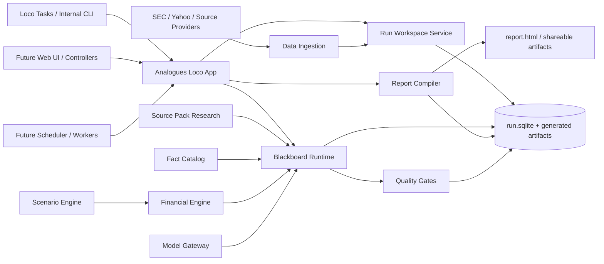

# System Map: Analogues

## Purpose

This document maps the intended system shape for Analogues as it moves from prototype tasks into a durable, blackboard-led stock research product.

It is not a full implementation design. It defines the major runtime components, likely module boundaries, architectural seams, dependency direction, and first refactor targets so multiple implementation threads can move without repeatedly colliding.

The map describes the eventual v1 shape, with a conservative v0.1 path that can start inside the existing Rust/Loco application before extracting separate crates.

## Architectural Posture

Analogues is a Rust/Loco application organized around per-run stock research workspaces.

The durable center of the product is not a chat transcript or a single generated HTML file. It is the run workspace: a directory plus `run.sqlite` containing source custody, raw facts, canonical mappings, reviewed entries, open signals, obligations, scenario assumptions, calculations, Monte Carlo outputs, and rendered artifacts.

Core posture:

- Rust/Loco remains the application shell for tasks, workers, controllers, and future scheduling.
- A per-run SQLite workspace is the source of truth for research state and artifact state.
- Deterministic ingestion and calculation run before or beside model-backed workers.
- Workers write structured board records, not final prose as their primary artifact.
- Final synthesis consumes reviewed board state and satisfied or waived obligations.
- Model calls are replaceable engines behind explicit contracts.
- SQLite-first calculations are preferred until the financial model clearly needs a separate math runtime.
- Refresh behavior should be expressed through dependency metadata before it becomes a sophisticated policy engine.

## Stage Markers

- **Current:** working logic exists mainly in `src/tasks/init_workspace.rs` and `src/tasks/generate_report.rs`.
- **v0.1:** task code is split into stable modules, with the same user-visible task commands still working.
- **v0.5:** blackboard ledgers, worker runs, entries, signals, obligations, quality gates, and calculation records are first-class tables.
- **v1:** bounded blackboard orchestration can dispatch workers, review outputs, converge, synthesize reports, and support partial refresh.
- **TBD:** areas where the policy should wait for more empirical cost and quality data.

## One-Page Shape



## Current Implementation Reality

The current task files prove useful product behavior, but they combine responsibilities that should become explicit seams.

`src/tasks/init_workspace.rs` currently owns:

- CLI parsing for `initWorkspace`.
- Ticker/date normalization and run directory allocation.
- SQLite schema creation.
- Seed data for run metadata, stock info, report sections, canonical metric definitions, and Monte Carlo config.
- Yahoo quote fetch.
- SEC ticker lookup and Company Facts fetch.
- Raw SEC fact flattening.
- Canonical metric mapping seed heuristics.
- Period-shape detection and TTM construction.
- Starter fundamental metric persistence.
- Data gaps and data quality flags.

`src/tasks/generate_report.rs` currently owns:

- CLI parsing for `generateReport`.
- Latest workspace resolution.
- Report payload loading from SQLite.
- Report-readiness validation.
- Scenario period roll-forward math.
- Valuation band construction from P/S and P/E assumptions.
- Scenario probability normalization.
- Deterministic Monte Carlo sampling.
- Monte Carlo persistence.
- HTML template rendering.
- Artifact registration.

The first refactor should preserve these task entry points while moving the logic behind narrower modules and contracts.

## Major Runtime Components

### Loco Application Shell

Stage: **current -> v1**

Responsibilities:

- Expose task commands such as `initWorkspace` and `generateReport`.
- Eventually expose controllers, admin pages, scheduler jobs, and workers.
- Wire concrete adapters into domain services.
- Own configuration, app startup, logging, and operational entry points.

Non-responsibilities:

- Does not own stock research domain logic.
- Does not contain provider-specific parsing.
- Does not perform calculations inline in controllers or task wrappers.

Likely current location:

- `src/tasks/*`
- `src/controllers/*`
- `src/workers/*`
- `src/app.rs`

### Run Workspace Service

Stage: **v0.1**

Responsibilities:

- Allocate run slugs and workspace directories.
- Create and open `run.sqlite`.
- Apply workspace schema versions.
- Seed required defaults.
- Provide typed access to workspace paths and run metadata.
- Keep task code free of direct path and schema setup details.

Non-responsibilities:

- Does not fetch external data.
- Does not decide which facts are analytically important.
- Does not synthesize report prose.

Primary seam:

- `WorkspaceStore`: create, open, migrate, seed, close, and resolve latest workspace.

Current extraction targets:

- `WorkspacePaths`
- `next_workspace_paths`
- `initialize_workspace`
- `initialize_run_database`
- `execute_schema`
- `seed_database`
- `resolve_workspace_paths`
- `latest_workspace_dir`

### Data Ingestion

Stage: **v0.1**

Responsibilities:

- Fetch raw provider payloads.
- Normalize provider payloads into durable raw observations.
- Preserve source custody, fetched-at timestamps, accession IDs, forms, periods, units, and raw JSON.
- Record provider failures as gaps or quality flags.

Non-responsibilities:

- Does not choose final scenario assumptions.
- Does not render report artifacts.
- Does not hide raw provider facts just because they are not canonical fundamentals.

Primary seams:

- `MarketDataProvider`: quote and current market metadata.
- `SecFactsProvider`: ticker lookup and Company Facts retrieval.
- `RawFactIngestor`: provider payload to persisted raw facts.

Current extraction targets:

- `fetch_financial_snapshot`
- `fetch_yahoo_chart_snapshot`
- `fetch_sec_companyfacts_snapshot`
- `lookup_sec_company`
- `fetch_json`
- `sec_raw_facts`
- `sec_raw_fact`

### Fact Catalog And Canonical Metrics
// @TODO: Discuss if we need this.  Not sure either way. Might be legacy carried over from earlier version where we attempted deterministic concept -> canon transform.
Stage: **v0.1 -> v0.5**

Responsibilities:

- Build deterministic catalog rows from raw SEC facts.
- Maintain canonical metric definitions and active company-specific mappings.
- Classify period shape: instant, quarter, YTD, annual, TTM, projected, mixed.
- Preserve exploratory concepts for agent review.
- Promote useful non-standard concepts into supporting metric selections.
- Expose compact query shapes for agents and calculations.

Non-responsibilities:

- Does not require one model call per concept.
- Does not discard sparse but analytically useful concepts.
- Does not own scenario probabilities.

Primary seams:

- `ConceptCatalog`: materialize and query raw concept inventory.
- `CanonicalMetricMapper`: seed, review, activate, and replace canonical mappings.
- `ObservationBuilder`: create period-aware observations from raw facts and mappings.

Current extraction targets:

- `CanonicalMetricSpec`
- `CANONICAL_METRIC_SPECS`
- `seed_canonical_metric_definitions`
- `seed_canonical_mappings`
- `canonical_sec_observations`
- `fact_period_type`
- `ttm_series_for_metric`
- `ttm_windows`
- `select_latest_income_bundle`
- `append_bundle_observations`

### Evidence And Source Custody

Stage: **v0.5**

Responsibilities:

- Store source documents, claims, citations, and source-backed claim metadata.
- Connect claims to narratives, cruxes, scenarios, watch items, analogues, and final sections.
- Distinguish management statements, filings, analyst claims, media narratives, and derived observations.
- Make citation coverage inspectable before report synthesis.

Non-responsibilities:

- Does not run the whole research loop.
- Does not decide final prose layout.
- Does not promote claims without source custody and confidence metadata.

Primary seams:

- `SourceRepository`: capture and query source documents and source metadata.
- `ClaimExtractor`: transform source text into claim candidates.
- `CitationResolver`: attach source references to board entries and final obligations.

Current schema anchors:

- `sources`
- `claims`
- source references on scenarios, watch items, analogues, and content blocks

### Blackboard Core

Stage: **v0.5**

Responsibilities:

- Persist durable entries, entry relations, signals, obligations, worker runs, quality gate results, and optional snapshots.
- Provide explicit query APIs for open signals, trusted entries, stale entries, obligations, and dependency relations.
- Keep domain-specific metadata in structured extension fields without forcing one global ontology.
- Make research state inspectable, replayable enough for debugging, and resumable across worker runs.

Non-responsibilities:

- Does not know SEC or valuation domain rules directly.
- Does not know model-provider APIs.
- Does not render product artifacts.

Primary seams:

- `BoardStore`: append and query entries, relations, signals, obligations, runs, and gate results.
- `BoardQuery`: read optimized board views without leaking ad hoc SQL everywhere.
- `BoardEventLog`: optional append-only event trail for replay and debugging.

Minimum v0.5 tables:

- `entries`
- `entry_relations`
- `signals`
- `obligations`
- `worker_runs`
- `quality_gate_results`
- `board_snapshots`

### Blackboard Runtime

Stage: **v1**

Responsibilities:

- Inspect board state.
- Dispatch focused workers against high-value open signals.
- Apply quality gates to worker outputs.
- Promote, quarantine, supersede, or dispute entries.
- Update obligations.
- Stop based on readiness and budget rather than exhaustive research.

Non-responsibilities:

- Does not own Analogues-specific report content.
- Does not depend on a specific model provider.
- Does not bypass deterministic workspace reads and writes.

Primary seams:

- `DomainAdapter`: Analogues-specific prompts, worker lanes, gates, output formats, and board projections.
- `Orchestrator`: plan next worker tasks or converge.
- `Worker`: return structured entries and signals.
- `QualityGate`: pass, warn, reject, or quarantine entries.
- `ModelClient`: provider-neutral model calls with usage and latency metadata.

Analogues worker lanes:

- Initialize workspace and ingest facts.
- Build canonical and exploratory fact catalogs.
- Build source pack and narrative map.
- Triage concepts into crux candidates.
- Run financial mechanics experiments.
- Construct scenarios and projection inputs.
- Calculate distribution and render artifacts.
- Synthesize report and refresh hooks.

### Financial Engine

Stage: **v0.1 -> v0.5**

Responsibilities:

- Run auditable financial calculations against approved workspace data.
- Persist calculation questions, SQL templates or formulas, inputs, outputs, interpretations, and dispositions.
- Build scenario period projections from baseline facts and assumptions.
- Compute valuation bands and Monte Carlo distributions.
- Record methodology and limitations.

Non-responsibilities:

- Does not choose source credibility.
- Does not write unreviewed narrative conclusions directly into final sections.
- Does not introduce an embedded scripting runtime until SQLite-native calculations are insufficient.

Primary seams:

- `AnalysisQueryStore`: persist reusable SQL templates and calculation experiments.
- `ScenarioCalculator`: convert scenario assumptions and periods into projected financial paths.
- `MonteCarloEngine`: sample scenario-conditioned terminal price distributions deterministically.
- `CalculationPromoter`: promote calculation outputs into board entries.

Current extraction targets:

- `build_scenario_data`
- `build_scenario_json`
- `scenario_outputs_from_value`
- `build_monte_carlo`
- `sampling_specs`
- `persist_monte_carlo`
- `distribution_summary`
- `histogram`
- `DeterministicRng`

### Scenario Engine

Stage: **v0.5 -> v1**

Responsibilities:

- Build scenario assumptions from reviewed cruxes, claims, calculations, and historical analogues.
- Keep scenario probabilities, crux links, confirming signals, breaking signals, and period assumptions explicit.
- Validate that scenario prose matches scenario math.
- Mark dependent scenarios stale when cruxes or facts change.

Non-responsibilities:

- Does not fetch raw facts.
- Does not directly call model providers.
- Does not render the chart UI.

Primary seam:

- `ScenarioRepository`: read and write scenario assumptions, crux assumptions, sensitivities, signals, and periods.

Current schema anchors:

- `scenario_assumptions`
- `scenario_crux_assumptions`
- `scenario_sensitivities`
- `scenario_signals`
- `scenario_periods`

### Report Compiler And Artifact Renderer

Stage: **v0.1 -> v1**

Responsibilities:

- Load report-ready board state.
- Validate final report obligations.
- Compile a structured report payload.
- Render HTML and later other shareable artifacts.
- Persist artifact records and source limitations.

Non-responsibilities:

- Does not perform source research.
- Does not own scenario math.
- Does not make unsupported claims to fill missing sections.

Primary seams:

- `ReportPayloadCompiler`: board state and workspace tables to structured JSON.
- `ReportReadinessGate`: final validation before render.
- `ArtifactRenderer`: structured payload to HTML or other artifact formats.
- `ArtifactStore`: record artifact paths and metadata.

Current extraction targets:

- `compile_report_payload`
- `validate_report_inputs`
- `render_report`
- `record_artifact`
- all `load_*` report query helpers
- `financial_snapshot_json`
- `historical_growth_json`
- `data_quality_json`
- `source_pack_json`
- `claim_table_json`

### Refresh And Invalidation

Stage: **v1**

Responsibilities:

- Represent which facts, claims, entries, scenarios, calculations, sections, and artifacts depend on each other.
- Mark derived records stale when source facts, source claims, cruxes, or prices change.
- Preserve still-valid long-lived research.
- Trigger targeted worker runs and recalculations.

Non-responsibilities:

- Does not decide product refresh cadence by itself.
- Does not eagerly regenerate all report content when a narrow invalidation is enough.

Primary seams:

- `DependencyGraph`: durable dependency relations across entries, facts, claims, calculations, scenarios, and artifacts.
- `InvalidationPolicy`: convert changed inputs into stale records and new signals.
- `RefreshPlanner`: select the smallest useful refresh path subject to quality and budget.

Likely invalidation rules:

- Changed raw fact stales derived observations, concept catalog metadata, calculations, and scenarios that depend on that concept.
- Superseded claim stales dependent entries and obligations.
- Changed crux stales dependent scenario assumptions, probabilities, watch items, and Monte Carlo outputs.
- Current price changes can refresh price-relative framing without forcing scenario assumption regeneration.

## Dependency Direction

The current repository should bias toward modules first, crates later.

Recommended near-term direction:

```text
src/tasks
  depends on app services only

src/services or src/domain
  workspace, ingestion, fact catalog, financial engine, report compiler

src/blackboard
  board records, store traits, runtime contracts, quality gates

src/data
  provider adapters and source-specific DTO parsing

src/views / templates
  artifact presentation only
```

Rules:

- Task wrappers may parse CLI vars, call one service, and print results.
- Provider adapters may depend on external HTTP and provider DTOs, but domain modules should not.
- Blackboard core should not depend on Analogues-specific SEC, valuation, or HTML rendering logic.
- The Analogues domain adapter may depend on blackboard core and domain services.
- Report rendering should depend on structured payloads, not on raw worker transcripts.
- Calculation modules may read approved workspace data and write calculation records, but should not silently mutate narrative sections.

Future crate split, if needed:

```text
analogues
  Loco app shell, controllers, tasks, workers, configuration

analogues-workspace
  run workspace paths, schema, migrations, typed SQLite access

analogues-data
  SEC, market data, source provider adapters

analogues-finance
  fact catalog, canonical metrics, calculations, scenarios, Monte Carlo

analogues-blackboard
  entries, signals, obligations, worker runs, gates, orchestration contracts

analogues-report
  report payload compilation and artifact rendering
```

Do not split crates before module seams stabilize. The first useful step is to make imports and public entry points express the boundaries inside the current crate.

## Key Data Flows

### New Report Run

1. `initWorkspace` parses ticker/date options.
2. Run workspace service allocates a workspace and applies schema.
3. Data ingestion fetches quote data and SEC Company Facts.
4. Raw facts are persisted with provenance.
5. Fact catalog seeds canonical definitions, mappings, observations, gaps, and quality flags.
6. Blackboard bootstrap seeds default obligations and initial signals.
7. Source and narrative workers gather evidence and write claims, entries, contradictions, and crux candidates.
8. Financial workers run analysis queries and promote useful calculations.
9. Scenario workers build scenario assumptions, periods, crux links, probabilities, and watch signals.
10. Financial engine computes scenario paths and Monte Carlo outputs.
11. Report compiler validates obligations, compiles payload JSON, renders artifacts, and records artifact metadata.

### Refresh Run

1. Refresh planner receives a changed input: new filing, new source, major price move, earnings, or manual rerun.
2. Data ingestion updates raw facts or source custody.
3. Invalidation policy marks dependent observations, entries, calculations, scenarios, sections, and artifacts stale.
4. Blackboard runtime creates refresh signals.
5. Workers address only the blocking signals needed for report readiness.
6. Financial engine recalculates affected scenario paths and Monte Carlo outputs.
7. Report compiler regenerates affected artifacts and records limitations for unresolved low-priority questions.

## Contract Specs

Initial contract specs now exist for the deterministic seams that should guide the first task-code refactor:

- [`WorkspaceStore`](contracts/workspace-store.md): path allocation, schema versioning, SQLite open modes, seeding, and workspace discovery.
- [`SecFactsProvider`](contracts/sec-facts-provider.md): SEC ticker lookup, Company Facts fetch, raw payload custody, rate limits, and extraction into raw facts.
- [`ConceptCatalog`](contracts/concept-catalog.md): deterministic period classification, catalog materialization, canonical mapping activation, and exploratory metric selection.
- [`ScenarioCalculator`](contracts/scenario-calculator.md): projection input requirements, period roll-forward rules, units, valuation multiples, blend weights, and validation errors.
- [`MonteCarloEngine`](contracts/monte-carlo-engine.md): sampling assumptions, deterministic seeds, probability normalization, histogram construction, and output persistence.
- [`ReportPayloadCompiler`](contracts/report-payload-compiler.md): required inputs, obligation checks, section payload shapes, source limitations, and artifact-ready payloads.

Remaining seams should get contract specs before substantial blackboard-runtime implementation:

- `BoardStore`: entries, relations, signals, obligations, worker runs, and status transitions.
- `ModelClient`: provider-neutral request, response, JSON mode, retries, usage, latency, and cost metadata.
- `Worker`: input context, expected structured output, allowed writes, and failure semantics.
- `QualityGate`: gate ordering, pass/warn/reject/quarantine behavior, and persistence of gate results.
- `InvalidationPolicy`: dependency relation types, stale status transitions, and refresh signal creation.

## First Refactor Sequence

The safest build path is to extract behavior behind the completed deterministic contracts without changing the product workflow.

1. Implement `WorkspaceStore` around run path allocation, schema setup, default seeding, and latest-workspace resolution.
2. Implement `SecFactsProvider` for SEC ticker lookup, Company Facts fetch, and raw fact extraction; keep Yahoo quote fetching behind a separate market-data adapter.
3. Implement `ConceptCatalog` for canonical metric specs, period classification, TTM construction, catalog materialization, and observation persistence.
4. Implement `ScenarioCalculator` with unit tests independent of Loco tasks.
5. Implement `MonteCarloEngine` with deterministic seed, probability normalization, histogram, and persistence tests.
6. Implement `ReportPayloadCompiler` for report SQLite loading, readiness validation, payload JSON shaping, and artifact metadata.
7. Keep `initWorkspace` and `generateReport` as thin task wrappers over the extracted services.
8. Add first blackboard tables: `entries`, `entry_relations`, `signals`, `obligations`, `worker_runs`, and `quality_gate_results`.
9. Add board bootstrap obligations and signals during workspace initialization.
10. Convert report readiness validation into obligation-aware quality gates.
11. Introduce worker contracts only after the board store and deterministic services are stable enough to inspect.

## Open Decisions

- Whether blackboard runtime should live in this repository permanently or become a reusable crate after Analogues v0.5 proves the interface.
- Whether Loco workers are enough for background orchestration or whether a dedicated runtime loop should own dispatch.
- How much source ingestion should be deterministic before model-backed claim extraction begins.
- Which model provider adapter should be first, and how much prompt/runtime metadata must be persisted for cost debugging.
- Whether report artifacts should remain static HTML first or move quickly toward server-rendered application views.
- How aggressively refresh should reuse old entries versus rerunning workers after new filings.

## Definition Of A Good v0.1 Boundary

The v0.1 refactor is successful when:

- `src/tasks/init_workspace.rs` and `src/tasks/generate_report.rs` are mostly task wrappers.
- Workspace creation, provider ingestion, fact cataloging, calculations, Monte Carlo, and report rendering can be tested without invoking Loco task plumbing.
- The run database remains the durable source of truth.
- Raw SEC facts and exploratory concepts are preserved even when canonical views are incomplete.
- Scenario math and report prose consume explicit stored records rather than hidden in-memory task state.
- New blackboard tables can be added without rewriting ingestion and report generation again.

