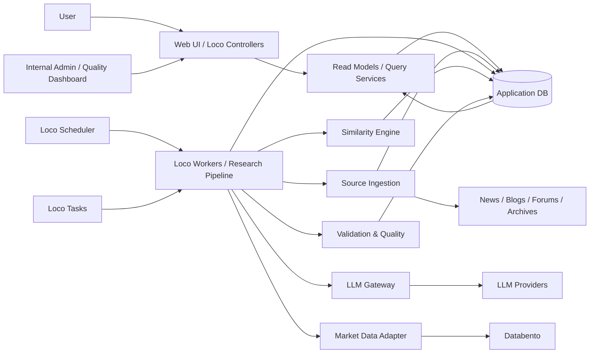
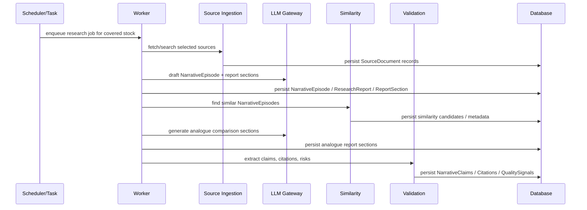
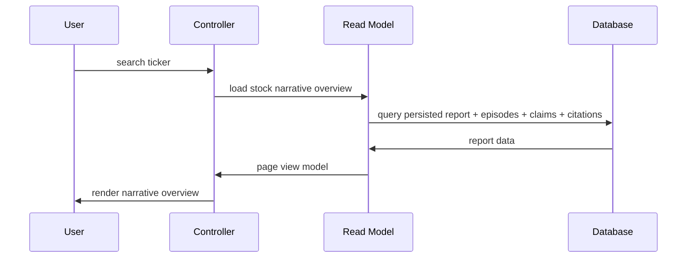
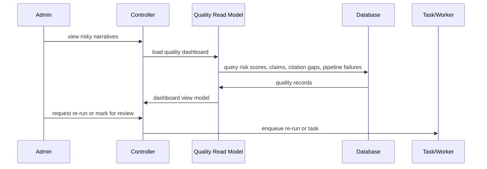

# System Map: Stock Narratives

## Purpose

This document maps the intended system shape for Stock Narratives.

It is not a full implementation design. It defines the major runtime components, likely crate boundaries, architectural seams, dependency direction, and build sequence needed to let multiple agents work in parallel without repeatedly colliding.

The map shows the eventual v1 shape, with v0.1 boundaries marked where the first implementation should focus.

## Architectural Posture

Stock Narratives is a Rust/Loco application organized around recurring research pipelines, persisted narrative artifacts, and source-backed validation.

The product should feel dynamic to users, but most expensive research work should happen before a user request. Users search for a stock and read a stable, persisted narrative report. The app does not regenerate expensive LLM analysis on every page load.

Core posture:

- Rust/Loco is the application framework.
- Loco workers handle async research jobs.
- Loco scheduler handles recurring coverage updates.
- Loco tasks handle manual/internal operations.
- Loco controllers stay thin and mostly serve persisted data.
- Database-backed domain objects are the source of truth.
- LLM outputs are persisted, inspectable, versioned enough for debugging, and validated after generation.
- Current v0.1 coverage is curated AI infrastructure stocks.
- The system should grow toward daily or event-triggered automated research over user-triggered generation.

## Stage Markers

The map uses these markers:

- **v0.1:** needed for the first internal "aha" moment.
- **v0.5:** needed for repeatable automated indexing.
- **v1:** needed for the polished research workspace.
- **TBD:** intentionally isolated uncertainty.

## One-Page Shape



## Primary Runtime Components

### Web UI And Controllers

Stage: **v0.1+**

Responsibilities:

- Search covered stocks.
- Render stock narrative overview pages.
- Render current narrative, bull case, bear case, counter-narrative, key assumptions, pivots, historical analogues, and source trail.
- Render internal quality dashboard pages.
- Trigger limited manual operations through admin actions or Loco tasks.

Non-responsibilities:

- Do not perform expensive research generation inline.
- Do not own narrative business logic.
- Do not contain source ingestion or LLM orchestration logic.

Frontend choice:

- **TBD:** Datastar, HTMX, or React.
- The current backend shape should not depend on that choice.
- If Datastar is chosen, prefer server-rendered fragments and SSE for pipeline/progress/admin dashboards.

### Loco Scheduler

Stage: **v0.1+**

Responsibilities:

- Run recurring coverage updates for curated stocks.
- Eventually run daily or event-triggered automation for larger coverage universes.
- Start research jobs through the same worker contracts used by manual tasks.

Non-responsibilities:

- Does not contain research logic.
- Does not directly write narrative artifacts except through pipeline entry points.

### Loco Workers / Research Pipeline

Stage: **v0.1+**

Responsibilities:

- Execute slow, retryable, IO-heavy research steps.
- Fetch and normalize source documents.
- Generate narrative episode drafts and report sections.
- Generate historical analogue report sections.
- Call validation and quality checks.
- Persist pipeline outputs and run metadata.

Non-responsibilities:

- Does not decide HTTP response shape.
- Does not expose raw vendor behavior to domain logic.
- Does not bypass validation metadata when persisting user-visible reports.

### Loco Tasks

Stage: **v0.1+**

Responsibilities:

- Seed curated coverage universe.
- Run one-off source imports.
- Backfill episodes and reports.
- Re-run a research pipeline for a stock or episode.
- Run diagnostics and data cleanup.

Non-responsibilities:

- Does not become a hidden second pipeline implementation.
- Does not mutate domain objects in ways workers cannot reproduce.

### Source Ingestion

Stage: **v0.1+**

Responsibilities:

- Search or fetch from a small selected set of news, blog, strategy, and forum-like sources.
- Capture source documents into the application database.
- Preserve URL/vendor/source identifiers alongside normalized text.
- Track publication date, retrieval date, publisher, source type, and coverage period when available.
- Support historical source-time reconstruction as well as current narrative collection.

Non-responsibilities:

- Does not generate final narrative reports.
- Does not perform market-data calculations.
- Does not expose source-specific quirks outside the adapter boundary.

### Market Data Adapter

Stage: **v0.1 for basic returns; v0.5+ for richer enrichment**

Responsibilities:

- Wrap Databento or other pricing/market data providers behind a stable internal interface.
- Provide price and return context for historical analogue outcomes.
- Eventually support relative returns, sector/index comparison, and basic time-window metrics.

Non-responsibilities:

- Does not own narrative interpretation.
- Does not own company fundamentals unless a future data provider makes that explicit.

### LLM Gateway

Stage: **v0.1+**

Responsibilities:

- Centralize calls to LLM providers.
- Own prompt templates, model selection, structured response parsing, retries, and provider errors.
- Record enough prompt/run metadata to debug pipeline behavior.
- Keep provider-specific SDK details out of domain and pipeline code.

Non-responsibilities:

- Does not own domain decisions.
- Does not directly write final report objects without a pipeline step.

### Similarity Engine

Stage: **v0.1+**

Responsibilities:

- Find similar current and historical narrative episodes.
- Use `NarrativeEpisode` embeddings plus structured episode properties.
- Produce candidate matches for report generation.
- Support explainable similarity sections generated downstream.

Non-responsibilities:

- Does not search raw source chunks in v0.1.
- Does not return black-box similarity as a final user-facing answer.

### Validation And Quality

Stage: **v0.1+**

Responsibilities:

- Treat `NarrativeClaim` as a first-class persisted object.
- Extract, validate, classify, and risk-score claims made in final report sections.
- Track citation coverage and citation quality.
- Identify narratives that may require human attention.
- Tag speculative weight, factual-claim density, implied performance promises, and other quality risks.
- Power internal dashboards focused on risk detection rather than mandatory approval.

Non-responsibilities:

- Does not need to block publication in v0.1.
- Does not need to settle the final claim-extraction strategy before the system map.
- Does not treat every citation as a narrative claim.

Important design stance:

- `NarrativeClaim` is first-class in v0.1 storage.
- `Citation` is broader than `NarrativeClaim`.
- Claims likely belong more to the validation framework than the generation framework.
- The exact LLM decision flow remains an ADR/design-spike topic.

### Application Database

Stage: **v0.1+**

Responsibilities:

- Persist stocks, narrative episodes, source documents, citations, claims, generated report sections, historical outcomes, pipeline runs, quality signals, and similarity metadata.
- Preserve stable report outputs so users see consistent research.
- Support inspection and debugging of generated artifacts.

Non-responsibilities:

- Does not become a dumping ground for provider-specific raw responses without normalized domain records.
- Does not hide source-time evidence, outcome data, and modern interpretation behind unstructured blobs unless explicitly part of a staged design choice.

## Core Domain Objects

### Stock

Stage: **v0.1+**

A publicly traded company/security. Users search for stocks, and stock pages route users to the most relevant current or active narrative episodes.

Likely fields:

- ticker
- company name
- exchange
- sector
- industry
- market cap, if available
- coverage status
- current active narrative episode

### CoverageUniverse

Stage: **v0.1+**

A curated set of stocks the system is allowed to research.

v0.1 should support AI infrastructure coverage through database seed data or an admin-managed table. Avoid hardcoding coverage lists into pipeline internals.

Likely fields:

- stock
- coverage group
- priority
- enabled/disabled
- refresh cadence
- notes

### NarrativeEpisode

Stage: **v0.1+**

The central domain object: a time-bounded market story about why a company's business performance, valuation, risk profile, or strategic position may change.

Responsibilities:

- Represent current, historical, and competing narratives.
- Support multiple simultaneous narratives per stock.
- Act as the primary similarity-search unit.
- Anchor report sections, claims, citations, scenarios, pivots, and historical outcomes.

Likely fields:

- stock
- title
- narrative type
- status: draft, active, historical, superseded, archived
- start date
- end date, nullable
- summary
- bull summary
- bear summary
- counter-narrative summary
- key assumptions
- key metrics
- key catalysts
- embedding
- structured similarity attributes

### ResearchReport

Stage: **v0.1+**

A persisted user-facing artifact generated for a stock or narrative episode.

Responsibilities:

- Provide the stable report experience shown in the UI.
- Group generated sections and associated validation metadata.
- Preserve consistency across users and page loads.

Likely fields:

- stock
- primary narrative episode
- report type
- generated_at
- pipeline run
- status
- quality summary

### ReportSection

Stage: **v0.1+**

A structured section inside a persisted research report.

Examples:

- Current Narrative
- Bull Case
- Bear Case
- Emerging Counter-Narrative
- What Changed Recently
- Key Assumptions
- Key Pivots
- Historical Analogues
- Analogy Breakers
- Similar Current Narratives

Likely fields:

- report
- section kind
- title
- body
- ordering
- generation metadata
- validation status

### SourceDocument

Stage: **v0.1+**

A captured source used as evidence.

Responsibilities:

- Preserve normalized source text in the application database.
- Preserve external identity: URL, vendor ID, publisher, publication date, retrieval date.
- Support both source-time evidence and current evidence.

Likely fields:

- source type
- publisher
- title
- URL
- vendor/source ID
- publication date
- retrieval date
- normalized text
- covered time period
- source reliability metadata

### Citation

Stage: **v0.1+**

A reference from a report section, claim, metric, scenario, analogue, or outcome to a source document or source span.

Important rule:

- Not every citation is a `NarrativeClaim`.
- Citations are the general evidence-linking primitive.

Possible citation types:

- factual support
- narrative-at-the-time support
- contested evidence
- metric source
- historical outcome source
- analogue comparison source
- generated interpretation support

### NarrativeClaim

Stage: **v0.1+**

A testable, interpretable, or risk-relevant assertion made by the system or found in source material.

Responsibilities:

- Power validation, risk scoring, citation coverage checks, and quality dashboards.
- Help distinguish factual claims, narrative claims, speculative claims, and implied performance promises.
- Provide a way to audit final reports without requiring mandatory manual review.

Likely fields:

- claim text
- claim type
- subject stock/episode/report section
- cited sources
- support status
- opposition status
- confidence/risk level
- speculation weight
- implied performance promise flag
- date first observed
- date last observed
- validation metadata

### Scenario

Stage: **v0.5+; minimal v0.1 if cheap**

A possible future narrative path over a 6-12 month horizon.

The system should preserve scenario thinking without becoming predictive or recommendation-like.

### Pivot

Stage: **v0.1+**

An observable event, metric, or development that could validate, weaken, break, or transform a narrative.

Examples:

- margin guidance
- backlog disclosure
- customer concentration disclosure
- regulatory decision
- filing delay
- short report
- major customer loss

### HistoricalOutcome

Stage: **v0.1 rough; v0.5+ richer**

A structured summary of what happened after a historical narrative episode.

Likely fields:

- outcome window
- stock return
- relative return, if available
- revenue/margin/valuation context, if available
- narrative resolution type
- key pivot events
- post-mortem summary

### PipelineRun

Stage: **v0.1+**

An execution record for a research workflow.

Responsibilities:

- Track what was run, when, why, and with which inputs.
- Preserve prompt/model/version metadata at useful granularity.
- Support debugging, re-runs, quality dashboards, and regression comparison.

## Major Architectural Seams

### Source Adapter Seam

Purpose:

- Normalize heterogeneous source providers into `SourceDocument` records.

Contract should define:

- search/fetch inputs
- normalized output shape
- source identity rules
- duplicate detection behavior
- failure/retry semantics
- date and timezone handling

Required tests:

- fixture normalization tests
- duplicate handling tests
- invalid/missing date tests
- provider error mapping tests

### Market Data Seam

Purpose:

- Hide Databento/provider details behind a stable price/return interface.

Contract should define:

- price series requests
- return-window requests
- symbol mapping behavior
- missing-data behavior
- adjustment assumptions

Required tests:

- fixture-based return calculations
- missing-data behavior
- provider error mapping

### LLM Gateway Seam

Purpose:

- Keep prompt execution, provider SDKs, structured parsing, and run metadata out of domain code.

Contract should define:

- prompt request shape
- structured output parsing
- model/provider configuration
- retry behavior
- token/cost metadata
- provider error mapping

Required tests:

- deterministic fake provider tests
- parse success/failure tests
- retry/error mapping tests

### Research Pipeline Seam

Purpose:

- Coordinate source ingestion, generation, similarity, validation, and persistence through explicit pipeline stages.

Contract should define:

- job inputs
- stage outputs
- idempotency rules
- re-run behavior
- persistence boundaries
- failure recovery

Required tests:

- pipeline smoke test with fixtures
- idempotent re-run test
- partial failure/retry test
- persisted artifact shape test

### Similarity Seam

Purpose:

- Retrieve similar narrative episodes using embeddings and structured attributes.

Contract should define:

- indexable episode representation
- query representation
- candidate result shape
- structured filters
- score semantics
- explanation inputs

Required tests:

- fixture match tests
- structured filter tests
- no-result behavior
- deterministic fake embedding tests

### Validation And Claim Seam

Purpose:

- Extract and evaluate claims from generated report sections and source evidence.

Contract should define:

- claim types
- citation types
- risk labels
- validation status
- support/opposition rules
- relationship between report sections, citations, and claims

Required tests:

- claim extraction fixtures
- citation coverage fixtures
- speculation/risk label fixtures
- report-section audit fixtures

### Report Read Model Seam

Purpose:

- Give controllers a stable query surface for stock pages and admin dashboards.

Contract should define:

- stock overview query
- report detail query
- historical analogue query
- quality dashboard query
- empty/stale/missing data behavior

Required tests:

- query fixtures for common page states
- missing report behavior
- multiple active narrative behavior

## Candidate Crate Boundaries

The first implementation can still live in a single Loco workspace, but the following crate boundaries are strong candidates because they represent real work boundaries and testing boundaries.

### `analogues_domain`

Stage: **v0.1+**

Owns:

- domain types and invariants
- shared enums
- validation helpers that do not require DB/framework access
- DTOs used across seams

Does not own:

- Loco controllers
- SeaORM models directly, unless the project chooses to collapse domain and persistence early
- provider SDK calls
- prompt execution

### `analogues_sources`

Stage: **v0.1+**

Owns:

- source adapter traits
- provider-specific source clients
- source normalization
- source fixtures

Does not own:

- final report generation
- validation scoring
- UI rendering

### `analogues_market_data`

Stage: **v0.1+**

Owns:

- Databento adapter
- market-data provider traits
- return calculations
- market-data fixtures

Does not own:

- narrative interpretation
- report generation

### `analogues_llm`

Stage: **v0.1+**

Owns:

- LLM provider gateway
- prompt execution interface
- structured response parsing utilities
- test fake providers

Does not own:

- product-specific narrative decisions
- DB persistence

### `analogues_pipeline`

Stage: **v0.1+**

Owns:

- research pipeline stage orchestration
- pipeline input/output contracts
- idempotency/re-run rules
- stage-level fixtures

Does not own:

- Loco worker registration
- HTTP controllers
- provider SDK details

### `analogues_similarity`

Stage: **v0.1+**

Owns:

- episode embedding/index contracts
- similarity query logic
- structured filtering/reranking logic
- fake embedding/index tests

Does not own:

- raw source chunk search in v0.1
- final report text

### `analogues_validation`

Stage: **v0.1+**

Owns:

- claim extraction contracts
- citation typing
- risk scoring
- report audit logic
- validation fixtures

Does not own:

- first-pass report generation
- mandatory manual approval workflow

### `analogues_web`

Stage: **v0.1+**

This may simply be the main Loco app crate at first.

Owns:

- controllers
- views/templates
- Loco workers/tasks/scheduler wiring
- SeaORM models and migrations
- auth/admin UI when needed

Does not own:

- provider-specific logic
- core pipeline rules hidden in controllers

## Dependency Direction

Preferred direction:

```text
web/loco app
  -> pipeline
  -> validation
  -> similarity
  -> sources
  -> market_data
  -> llm
  -> domain
```

More precisely:

- All crates may depend on `analogues_domain`.
- `analogues_sources`, `analogues_market_data`, and `analogues_llm` should not depend on the Loco app.
- `analogues_pipeline` may depend on source, market data, LLM, similarity, validation, and domain contracts.
- `analogues_validation` may depend on domain and LLM contracts, but should avoid depending on pipeline internals.
- `analogues_web` wires everything together through Loco models, controllers, workers, scheduler, and tasks.

Forbidden direction:

- Provider adapters must not call controllers.
- Controllers must not call vendor SDKs directly.
- Source adapters must not generate final reports.
- LLM provider code must not know about Loco request handlers.
- Validation must not require a specific generation strategy.

## Core Data Flows

### v0.1 Curated Stock Research Flow



### User Read Flow



### Admin Quality Flow



## Pipeline Strategy Options To Evaluate

The system should not commit too early to one LLM decision flow. The stable requirement is that final reports have persisted `NarrativeClaim`, `Citation`, validation status, and risk metadata.

### Option A: Report First, Then Validate

Flow:

1. Gather sources.
2. Generate report sections.
3. Extract claims from final report.
4. Link citations and score risk.

Pros:

- Fastest route to a visible internal "aha" moment.
- Keeps generation simple.
- Validates exactly what the user will read.

Cons:

- Report may be shaped before the claim graph is understood.
- Validation may discover structural problems late.

### Option B: Source Claims First, Then Report

Flow:

1. Gather sources.
2. Extract claims from sources.
3. Build a source-time claim graph.
4. Generate report from claim graph.
5. Validate final report claims.

Pros:

- Better evidentiary discipline.
- Cleaner separation between what sources said and what the system inferred.

Cons:

- More upfront complexity.
- Slower to reach a useful prototype.
- May overfit v0.1 around claim infrastructure before narrative UX is proven.

### Option C: Hybrid Coarse Claims, Report, Then Audit

Flow:

1. Gather sources.
2. Extract coarse source claims and themes.
3. Generate narrative report.
4. Extract final report claims.
5. Compare source claims, report claims, citations, and risk labels.

Pros:

- Balanced v0.1 option.
- Preserves claim-first discipline where useful.
- Still keeps final report validation central.

Cons:

- More moving parts than Option A.
- Needs careful stage contracts.

### Option D: Multi-Agent Reviewer Flow

Flow:

1. Generation agent drafts report.
2. Claim reviewer extracts factual/narrative/speculative claims.
3. Citation reviewer checks support.
4. Risk reviewer scores speculation and implied performance promises.
5. Final aggregator persists report and quality metadata.

Pros:

- Mirrors the trust requirements well.
- Makes validation roles explicit and testable.

Cons:

- Higher cost and orchestration complexity.
- Needs strong observability to debug disagreements.

Recommended v0.1 stance:

- Start with Option A or C.
- Persist data in a way that does not block moving toward B or D.
- Write an ADR before implementing the final validation pipeline.

## Source-Time, Outcome, And Interpretation Modeling

This remains the most important domain uncertainty to isolate.

The product needs to distinguish:

- what was knowable at the time
- what people were claiming at the time
- what happened later
- how the system currently interprets the episode

Possible designs:

### Design 1: Separate Tables

Examples:

- `source_time_evidence`
- `historical_outcomes`
- `modern_interpretations`

Best when:

- Strong hindsight-leakage protection is needed early.
- Historical analogue quality is central.

Risk:

- More schema and pipeline complexity in v0.1.

### Design 2: One Episode With Typed Sections

Examples:

- `NarrativeEpisode`
- `ReportSection(section_kind = source_time_evidence | outcome | interpretation)`

Best when:

- Speed matters more than strict data modeling.
- The team wants to keep the first prototype compact.

Risk:

- Boundaries may become blurry unless section types and validation rules are strict.

### Design 3: Evidence Graph Plus Report Projection

Examples:

- source documents, citations, claims, metrics, outcomes as evidence nodes
- reports as generated projections from the evidence graph

Best when:

- Validation and traceability become the central system value.

Risk:

- Likely too heavy for v0.1 unless kept very small.

Recommended v0.1 stance:

- Keep this behind `analogues_domain`, `analogues_validation`, and report-section contracts.
- Do not let controllers or source adapters assume one final modeling choice.
- Prefer typed report sections plus first-class claims/citations for v0.1 unless an ADR chooses a stricter split.

## v0.1 Build Sequence

The first development sequence should optimize for an internal "aha" moment: search a covered AI infrastructure ticker and see a stable, source-backed narrative report with rough historical analogues and visible quality metadata.

### Step 1: Loco App Skeleton

Deliver:

- Loco app initialized.
- Database configured.
- Basic health route.
- Initial model/migration workflow proven.
- Worker, task, and scheduler wiring proven.

### Step 2: Domain And Persistence Foundation

Deliver:

- `Stock`
- `CoverageUniverse`
- `NarrativeEpisode`
- `ResearchReport`
- `ReportSection`
- `SourceDocument`
- `Citation`
- `NarrativeClaim`
- `PipelineRun`

Use fixtures for a small AI infrastructure universe.

### Step 3: Source Ingestion Slice

Deliver:

- One or two source adapters.
- Source search/fetch task.
- Normalized `SourceDocument` persistence.
- Fixture-based adapter tests.

### Step 4: LLM Gateway Slice

Deliver:

- LLM gateway trait/interface.
- Fake provider for tests.
- One real provider implementation.
- Structured response parsing tests.

### Step 5: First Research Pipeline

Deliver:

- Worker that generates one stock report from stored source documents.
- Persisted `NarrativeEpisode`, `ResearchReport`, and `ReportSection`.
- Pipeline run logging.
- Idempotent re-run behavior.

### Step 6: Historical Analogue Slice

Deliver:

- Minimal historical episode generation or seeding.
- NarrativeEpisode embeddings or fake similarity for first pass.
- Similar episode retrieval.
- Generated analogue comparison report section.

### Step 7: Validation And Quality Slice

Deliver:

- Extract `NarrativeClaim` records from final report sections.
- Persist `Citation` records.
- Apply basic risk labels.
- Show citation gaps and risky narratives in admin dashboard.

### Step 8: User Narrative Page

Deliver:

- Ticker search for covered stocks.
- Stock narrative overview page.
- Current narrative, bull/bear/counter, assumptions, pivots, sources, historical analogues.
- Clear stale/missing/report-not-ready states.

### Step 9: Recurring Automation

Deliver:

- Scheduler job for covered-stock refresh.
- Queue-based worker execution.
- Dashboard visibility into latest pipeline runs.

## v0.5 Expansion

Focus:

- More automated source ingestion.
- Better episode drafting.
- More robust similarity indexing.
- More explicit scenario generation.
- Human-review tooling for risky narratives.
- Expanded current narrative clusters.

Add:

- scenario tree generation
- pivot tracker
- richer historical outcomes
- stronger prompt/version observability
- structured similarity metadata beyond generated explanations
- more source adapters

## v1 Expansion

Focus:

- Polished research workspace.
- Watchlists.
- Alerts.
- Narrative timeline.
- Source explorer.
- Similar current narratives browser.
- Shareable/exportable research pages.
- User accounts and saved research.

## Open ADRs

These decisions should be captured before or during crate charters and contract specs.

1. Frontend direction: Datastar, HTMX, or React.
2. Validation pipeline strategy: report-first, claim-first, hybrid, or multi-agent reviewer.
3. Source-time/outcome/modern-interpretation storage model.
4. Citation taxonomy and claim taxonomy.
5. Embedding/index storage: database-native, external vector DB, or hybrid.
6. Market-data scope for v0.1: basic returns only or richer outcome metrics.
7. Admin workflow: risk dashboard only, soft review flags, or approval gates.
8. Source acquisition and licensing strategy.

## What The System Map Intentionally Does Not Decide

- Exact frontend framework.
- Exact source vendors beyond Databento for market data.
- Exact historical source archive strategy.
- Exact LLM provider/model choices.
- Exact prompt designs.
- Exact internal module layout inside each crate.
- Whether v0.1 uses strict separate evidence/outcome/interpretation tables or typed report sections.

## Guiding Constraints For Future Docs

Crate charters should preserve these boundaries:

- Controllers are request adapters, not research engines.
- Workers run pipelines; tasks trigger operations; scheduler triggers recurring work.
- Source adapters normalize sources but do not interpret narratives.
- LLM gateway executes prompts but does not own product decisions.
- Similarity operates over narrative episodes, not raw source chunks in v0.1.
- Validation owns claims, citations, risk scoring, and quality signals.
- Reports are persisted artifacts, not transient chat responses.
- The first product slice should be contrived but real enough to show the narrative research value.
