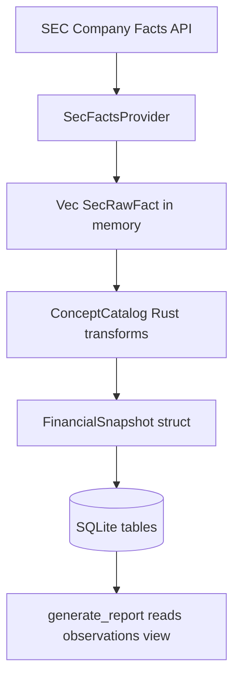
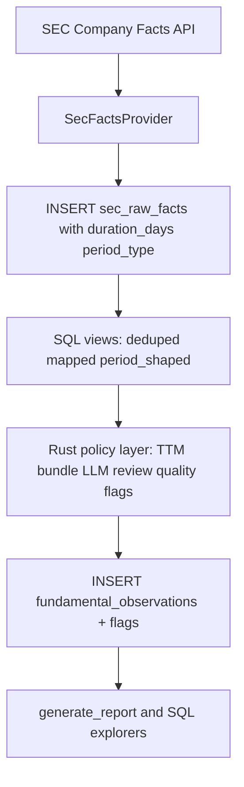

# SEC Raw Facts: In-Memory Rust Parsing vs. SQL-First Analysis

This document compares the current `initWorkspace` fundamentals path — where `SecRawFact` rows are parsed and transformed in Rust (`concept_catalog.rs`) before being written to SQLite — with an alternative where structured raw facts land in the database first and most selection, rollup, and canonical joins happen as SQL views or queries.

It is informed by:

- `src/tasks/init_workspace.rs` — ingest, snapshot assembly, persistence
- `src/services/concept_catalog.rs` — catalog materialization, canonical mapping, TTM bundles, observation building
- `docs/candidate-product-directions/concept-1-narrative-historical-focus/02-system-map.md` — database-as-source-of-truth posture
- `docs/qa/phase-5-sqlite3-orcl-analysis.md` — empirical SQL-only exploration on a real ORCL workspace
- `docs/qa/database-structure-analysis.md` — schema inventory and drift notes

## Executive Summary

The instinct is directionally correct: **`sec_raw_facts` is already a strong table**, and a meaningful share of `concept_catalog.rs` logic is re-implementing aggregations and filters that SQLite can express cleanly once period semantics and deduplication are normalized at ingest or in views.

However, the current Rust layer is not accidental complexity. It encodes **non-trivial financial semantics** — contiguous TTM windows, income-statement period alignment, canonical concept scoring, LLM review orchestration, and quality-flag generation — that are awkward, verbose, or brittle in raw SQL.

A practical path is **not** “delete `concept_catalog.rs` and move everything to SQL.” It is:

1. **Land raw facts in a query-friendly shape** (possibly with a few derived columns computed once at insert).
2. **Promote repeatable read patterns to SQL views** (deduped facts, period-shaped series, canonical joins).
3. **Keep orchestration and judgment in Rust** (bundle selection policy, LLM review, quality flags, snapshot assembly) but have it **read from the DB or shared view definitions** instead of re-scanning in-memory `Vec<SecRawFact>`.

That split aligns with the system map’s “database-backed domain objects are the source of truth” without pretending SQLite is a good home for every heuristic.

---

## Current Architecture

### Data flow today



### What happens during `fetch_sec_companyfacts_snapshot`

1. `SecFactsProvider::extract_raw_facts` flattens the SEC JSON into `Vec<SecRawFact>`.
2. `ConceptCatalog::materialize_catalog_entries` groups facts in Rust and computes period shapes, usability, plot readiness, and narrative tags.
3. `ConceptCatalog::seed_canonical_mappings` (or LLM-reviewed promotion) picks canonical concept mappings from catalog entries.
4. `ConceptCatalog::build_observations` joins mappings to raw facts in Rust and emits `FundamentalObservation` rows.
5. `ConceptCatalog::select_latest_baseline_bundle` runs TTM/annual selection logic across revenue, net income, gross profit, and operating income.
6. Additional headline fields (shares, EPS, cash, debt) are selected via helpers like `latest_value_fact` and `total_latest_values`.
7. `persist_financial_snapshot` bulk-inserts into:
   - `sec_raw_facts`
   - `concept_catalog_entries`
   - `canonical_metric_mappings`
   - `fundamental_observations`
   - `fundamentals` (compressed headline compatibility table)
   - `data_quality_flags`

After init, **`generate_report` does not re-run `ConceptCatalog`**. It reads `canonical_fundamental_observations` from SQLite. The Rust parsing layer is effectively a **write-time ETL** that runs once per workspace initialization.

### Inventory of Rust-side SEC fact utilities

| Function / area | Role | SQL analogue difficulty |
| --- | --- | --- |
| `materialize_catalog_entries` | Group by taxonomy/concept/unit; min/max dates and values; period-shape histograms; narrative tags | **Medium** — base rollup exists as `raw_fact_metric_catalog` view; period-shape and tags need extra columns or views |
| `seed_canonical_mappings` / `canonical_mapping_candidates` | Score concepts against canonical metric specs using aliases, text heuristics, period-shape fit | **Hard** — heavy string heuristics and scoring tables; LLM path stays in Rust |
| `facts_for_canonical` | Join active mappings to matching raw facts | **Easy** — straightforward join on `canonical_metric_mappings` |
| `latest_value_fact` | Filter by period cutoff; max by `(period_end, filed_at)` | **Easy** — `ROW_NUMBER()` or `MAX` with tie-break (see cheatsheet templates) |
| `latest_quarter_facts` | Dedupe by `period_end`, prefer latest filing; filter form and duration | **Medium** — window functions + `julianday` duration filters |
| `ttm_windows` | Sum four contiguous quarterly facts spanning ~300–390 days | **Hard** — self-joins or recursive logic; correctness-sensitive |
| `select_latest_income_bundle` | Find latest period where revenue and net income align; attach optional gross/operating with quality flags | **Hard** — multi-metric alignment policy, not just SQL aggregation |
| `fact_period_type` / `classify_period` | Derive quarter / annual / ytd / instant from duration and form | **Medium** — doable with generated column or view using `julianday` |
| `build_observations` | Explode mapping × fact into observation rows | **Easy–medium** — `INSERT … SELECT` from join view |
| `apply_income_bundle` | Write derived TTM observations and margins into snapshot | **Medium** — could be SQL inserts from computed CTEs |

`concept_catalog.rs` is roughly **1,250 lines**, with the SEC-selection core (`latest_value_fact` through `ttm_windows`) occupying the bottom third.

### What SQL already provides

The schema already anticipates SQL-first exploration:

```sql
-- src/tasks/init_workspace.rs (abbreviated)
CREATE TABLE sec_raw_facts (
    id INTEGER PRIMARY KEY AUTOINCREMENT,
    taxonomy TEXT NOT NULL,
    concept_name TEXT NOT NULL,
    ...
    period_start TEXT,
    period_end TEXT,
    filed_at TEXT,
    metric_value REAL NOT NULL,
    raw_json TEXT NOT NULL,
    ...
);

CREATE INDEX idx_sec_raw_facts_concept_period
    ON sec_raw_facts(taxonomy, concept_name, unit, period_end, filed_at);

CREATE VIEW raw_fact_metric_catalog AS
    SELECT taxonomy, concept_name, label, description, unit,
           COUNT(*) AS fact_count,
           MIN(period_end) AS earliest_period_end,
           MAX(period_end) AS latest_period_end,
           ...
    FROM sec_raw_facts
    GROUP BY taxonomy, concept_name, label, description, unit;
```

`docs/references/financial-math-cheatsheet.md` documents SQL templates for latest instant snapshots, annual trends, and Q3-from-YTD derivations — the same problems `latest_value_fact` and `latest_quarter_facts` solve in Rust.

`docs/qa/phase-5-sqlite3-orcl-analysis.md` confirms that **25k+ `sec_raw_facts` rows are sufficient for real mechanics work in SQL**, but notes friction around period semantics, amended-filing dedupe, and promoting experiments into structured downstream tables.

---

## The Core Tension

### System map expectation

From `02-system-map.md`:

- “Database-backed domain objects are the source of truth.”
- “The application database … does not become a dumping ground for provider-specific raw responses **without normalized domain records**.”
- Report read models should query persisted data; controllers should not own research logic.

### Current implementation posture

- Raw facts **are** persisted, but **canonical selection logic lives only in Rust** during init.
- `concept_catalog_entries` **duplicates** much of `raw_fact_metric_catalog` plus Rust-only fields (`period_shape_counts`, `narrative_tags`, `series_usability`, `plot_readiness`).
- Analysts and agents doing SQL exploration must **re-derive** period typing, deduplication, and canonical joins that the Rust code already encodes.
- `fundamental_observations` is the durable query surface for reports, but it is a **materialized output** of Rust policy, not something recomputed from views on demand.

So the gap is not “raw facts aren’t in the DB.” The gap is **“the interpretive layer over raw facts is not queryable or reusable outside the init-time Rust pass.”**

---

## Approach A: Current — Parse `SecRawFact` in Rust, Persist Results

### How it works

SEC JSON → `Vec<SecRawFact>` → `ConceptCatalog` transforms → snapshot structs → bulk SQL inserts.

Example of the pattern the user flagged:

```rust
// concept_catalog.rs — latest_value_fact
facts_for_canonical(raw_facts, mappings, canonical_key, unit_hint)
    .into_iter()
    .filter(|fact| prefer_period_end.is_none_or(|period_end| { ... }))
    .max_by(|left, right| {
        (left.end.as_deref().unwrap_or(""), left.filed.as_deref().unwrap_or(""))
            .cmp(&(right.end.as_deref().unwrap_or(""), right.filed.as_deref().unwrap_or("")))
    })
```

### Pros

| Benefit | Why it matters |
| --- | --- |
| **Type safety and testability** | `ttm_windows`, period classification, and mapping scoring have unit tests in Rust; pure functions are easy to fixture. |
| **Expressive date/period logic** | `chrono` and Rust control flow are clearer than SQLite `julianday` thresholds for YTD vs quarter vs annual. |
| **Single-pass init performance** | One in-memory scan can feed catalog, mappings, observations, and headline metrics without round-trips. |
| **Clear seam with LLM review** | `ConceptMappingStrategy::LlmReviewed` promotes mappings from model output; this naturally lives in application code. |
| **Policy encoded as code** | Income bundle alignment, EPS/share period matching, and quality flags are explicit and versioned with deploys. |
| **Provider contract stays clean** | `SecFactsProvider` only extracts; interpretation remains in domain services per `docs/contracts/sec-facts-provider.md`. |

### Cons

| Cost | Why it matters |
| --- | --- |
| **Logic is not inspectable via SQL** | Agents and QA must read Rust or duplicate logic in ad hoc queries (already observed in Phase 5 QA). |
| **Duplication with schema views** | `raw_fact_metric_catalog` vs `materialize_catalog_entries`; two definitions of “concept rollup.” |
| **Write-only ETL** | Re-running a subset (e.g., new canonical mapping) requires re-fetch or re-loading facts into structs. |
| **Large in-memory working set** | ~25k facts per ticker is fine today; multi-ticker batch jobs may not scale as gracefully as set-oriented SQL. |
| **Drift risk vs documentation** | SQL cheatsheet templates and Rust utilities can diverge unless tied to shared view definitions. |
| **Observation lineage is weak** | `fundamental_observations` rows do not FK back to `sec_raw_facts.id`; auditing “why this TTM?” requires prose `source_note` fields. |

---

## Approach B: SQL-First — Structure Raw Facts in DB, Query There

### How it would work

SEC JSON → insert into `sec_raw_facts` (possibly with derived columns) → SQL views for deduped facts, period shapes, canonical joins → Rust (or SQL `INSERT … SELECT`) materializes only **policy outputs** (headline snapshot, quality flags, observations).

### Candidate schema enrichments

These are incremental, not a rewrite:

| Addition | Purpose |
| --- | --- |
| `duration_days INTEGER` (computed at insert) | Removes repeated `julianday` math in every query |
| `period_type TEXT` (`instant`, `quarter`, `ytd`, `annual`) | Mirrors `fact_period_type`; stable filter column |
| `is_latest_filing INTEGER` or view `sec_raw_facts_deduped` | `ROW_NUMBER() OVER (PARTITION BY concept, unit, period_start, period_end ORDER BY filed_at DESC, id DESC)` |
| `canonical_mapped_facts` view | Join `sec_raw_facts` to active `canonical_metric_mappings` |
| `concept_catalog_v` view | Extend `raw_fact_metric_catalog` with period-shape counts via conditional aggregation |
| `latest_canonical_facts` view | Per-canonical-key latest value with optional period cutoff parameter via table-valued pattern or scoped query |

### Example: `latest_value_fact` as SQL

Conceptually equivalent to the Rust helper:

```sql
WITH mapped AS (
  SELECT f.*
  FROM sec_raw_facts f
  JOIN canonical_metric_mappings m
    ON m.taxonomy = f.taxonomy
   AND m.concept_name = f.concept_name
   AND m.unit = f.unit
   AND m.is_active = 1
  WHERE m.canonical_key = :canonical_key
    AND f.unit LIKE '%' || :unit_hint || '%'
    AND (
      :prefer_period_end IS NULL
      OR f.period_end <= :prefer_period_end
      OR f.period_start <= :prefer_period_end
    )
)
SELECT *
FROM mapped
ORDER BY period_end DESC, filed_at DESC, id DESC
LIMIT 1;
```

This is shorter and more portable than the TTM bundle selector.

### Pros

| Benefit | Why it matters |
| --- | --- |
| **Aligns with system map** | DB becomes the interactive research surface, not just a snapshot store. |
| **Agent- and analyst-friendly** | Phase 5 QA already succeeded with `sqlite3`; views reduce copy-pasted dedupe logic. |
| **Reusable read models** | Same view serves init, report regen, quality dashboards, and ad hoc experiments. |
| **Smaller Rust surface** | `facts_for_canonical`, `latest_value_fact`, and observation explosion shrink or disappear. |
| **Refresh flexibility** | New mapping or corrected period_type column → re-`INSERT … SELECT` observations without SEC re-fetch. |
| **Inspectable intermediates** | “Show me all facts considered for revenue TTM” becomes a `SELECT`, not a debugger session. |

### Cons

| Cost | Why it matters |
| --- | --- |
| **TTM and bundle alignment are painful in SQL** | `ttm_windows` and `select_latest_income_bundle` need multi-step CTEs; errors are harder to spot than in tested Rust. |
| **Canonical scoring heuristics** | Alias tables + `LIKE` scoring in SQL is maintainability-negative; LLM review still needs Rust. |
| **SQLite ergonomics** | No true stored procedures; view parameterization is clunky; complex logic spreads across many views. |
| **Testing story weakens** | SQL view tests need fixture DBs or migration snapshots; less ergonomic than `#[test]` on pure functions. |
| **Migration/versioning burden** | View changes require schema migrations; run DBs at different versions complicate support. |
| **Risk of partial migration** | Worst case: logic in **both** Rust and SQL with subtle differences (e.g., unit matching case rules). |

---

## Side-by-Side Comparison

| Dimension | Current Rust-on-structs | SQL-first with views |
| --- | --- | --- |
| **Source of truth for interpretation** | `concept_catalog.rs` at init time | Views + materialized observations |
| **Ad hoc research (Phase 5)** | Re-implement filters in SQL | Native |
| **Report generation** | Reads persisted observations | Same, or could refresh from views |
| **TTM / multi-metric alignment** | Strong fit for Rust | Doable but brittle |
| **Canonical concept discovery** | Strong fit for Rust (+ LLM) | Poor fit for SQL alone |
| **Unit tests** | Strong | Weaker |
| **Lineage / auditability** | Weak FK linkage today | Can add `source_fact_id` in SQL-generated observations |
| **Performance at init** | Good (single memory pass) | Good if set-oriented; extra round-trips if naive |
| **Alignment with `02-system-map.md`** | Partial — DB stores outputs, not logic | Stronger for read models and inspection |

---

## What Should Move, What Should Stay

### Good candidates to move toward SQL

1. **Deduped fact access** — one view used by docs, agents, and Rust.
2. **Period typing** — compute `duration_days` and `period_type` once at insert (or in a generated column/view).
3. **Concept rollups** — merge `raw_fact_metric_catalog` and `materialize_catalog_entries` into one canonical view; optionally keep a materialized table for tags if JSON aggregation is too ugly.
4. **`facts_for_canonical` / `latest_value_fact`** — join + order queries are view-worthy.
5. **Observation explosion for non-derived rows** — `INSERT INTO fundamental_observations SELECT … FROM canonical_mapped_facts`.
6. **Lineage** — carry `sec_raw_facts.id` into observations when inserting from SQL.

### Reasonable to keep in Rust (for now)

1. **TTM window detection and contiguous-quarter validation** — correctness-sensitive; keep tested Rust or wrap a single SQL CTE behind a documented view with fixture tests.
2. **Income bundle selection policy** — choosing the latest period where revenue and net income cohere, with quality flags for missing gross/operating — is product policy, not aggregation.
3. **LLM concept review orchestration** — inherently application-layer.
4. **Quality flag generation** — cross-metric consistency checks (EPS period vs share count period) read better as explicit code.
5. **SEC JSON extraction** — stays in `SecFactsProvider` per contract.

---

## Hybrid Recommendation

Treat **`sec_raw_facts` + derived columns + dedupe/period views** as the stable analytical substrate. Treat **`fundamental_observations` + quality flags** as policy outputs materialized from that substrate.

### Proposed target flow



### Phased migration (low risk)

| Phase | Change | Rust removed / reduced |
| --- | --- | --- |
| **0 — Document** | Point cheatsheet templates at future view names; mark Rust helpers that have SQL equivalents | None |
| **1 — Enrich ingest** | Add `duration_days`, `period_type` at insert; add `sec_raw_facts_deduped` view | `fact_period_type` calls in queries |
| **2 — Unify catalog rollup** | Replace `materialize_catalog_entries` input with `SELECT` from enriched view; write `concept_catalog_entries` from same query | Duplicate rollup logic |
| **3 — View-backed selection** | Implement `latest_canonical_fact` as view; rewrite `latest_value_fact` to query DB during init | In-memory `facts_for_canonical` for simple lookups |
| **4 — Observation lineage** | `INSERT … SELECT` for raw mapped observations with `source_fact_id` | Part of `build_observations` |
| **5 — TTM view (optional)** | Encapsulate `ttm_windows` in a tested SQL view `ttm_candidates` | Only if fixture tests prove parity |

Avoid big-bang deletion of `concept_catalog.rs`. Shrink it into a **policy module** that consumes SQL views instead of raw `Vec<SecRawFact>`.

---

## Decision Criteria

Use these questions when choosing Rust vs SQL for a new SEC fact transform:

| Question | Lean SQL | Lean Rust |
| --- | --- | --- |
| Will analysts/agents run this ad hoc? | Yes | No |
| Is it a simple filter/join/aggregate? | Yes | No |
| Does it encode product policy or quality judgment? | No | Yes |
| Does it need LLM or external IO? | No | Yes |
| Is correctness subtle (TTM contiguity, YTD diffs)? | Rarely | Usually |
| Must it be unit-tested in isolation without a DB? | No | Yes |

---

## Risks of Each Extreme

### Extreme: keep everything in Rust structs

- Phase 5-style SQL exploration remains unnecessarily hard.
- Documentation and code continue to diverge.
- Refresh and invalidation require full re-init to reinterpret facts.

### Extreme: move everything to SQL

- TTM/bundle/LLM paths become unmaintainable SQL strings.
- Testing and refactors slow down.
- SQLite-specific view sprawl locks in dialect assumptions.

---

## Bottom Line

**Yes — getting raw data into the database in a more queryable shape would simplify a lot of utility code.** Functions like `latest_value_fact`, `facts_for_canonical`, and much of `materialize_catalog_entries` are natural SQL. The schema and Phase 5 QA already support this direction.

**No — that alone does not eliminate `concept_catalog.rs`.** The valuable, hard-to-replace parts are financial **policy**: contiguous TTM construction, multi-metric period alignment, canonical scoring heuristics, LLM review, and quality-flag generation. Those should stay in Rust (or in a dedicated calculation layer), but they should **read from SQL views** rather than from ephemeral structs.

The system map’s “database-backed source of truth” is best served by making **interpretive read models** (deduped facts, period-shaped series, canonical joins) first-class in SQLite, while keeping **judgment and orchestration** in the application layer — with a single definition of each repeatable transform, not two parallel implementations in Rust and ad hoc SQL.

---

## Related Documents

- `docs/qa/database-structure-analysis.md` — table-level inventory; notes `raw_fact_metric_catalog` as a good SQL read model
- `docs/qa/phase-5-sqlite3-orcl-analysis.md` — empirical limits of SQL-only research
- `docs/references/financial-math-cheatsheet.md` — query templates that should converge with future views
- `docs/contracts/sec-facts-provider.md` — provider must not own canonical interpretation
- `docs/candidate-product-directions/concept-1-narrative-historical-focus/02-system-map.md` — persistence and read-model expectations
