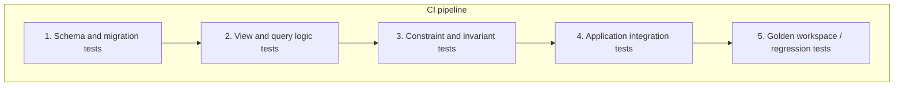
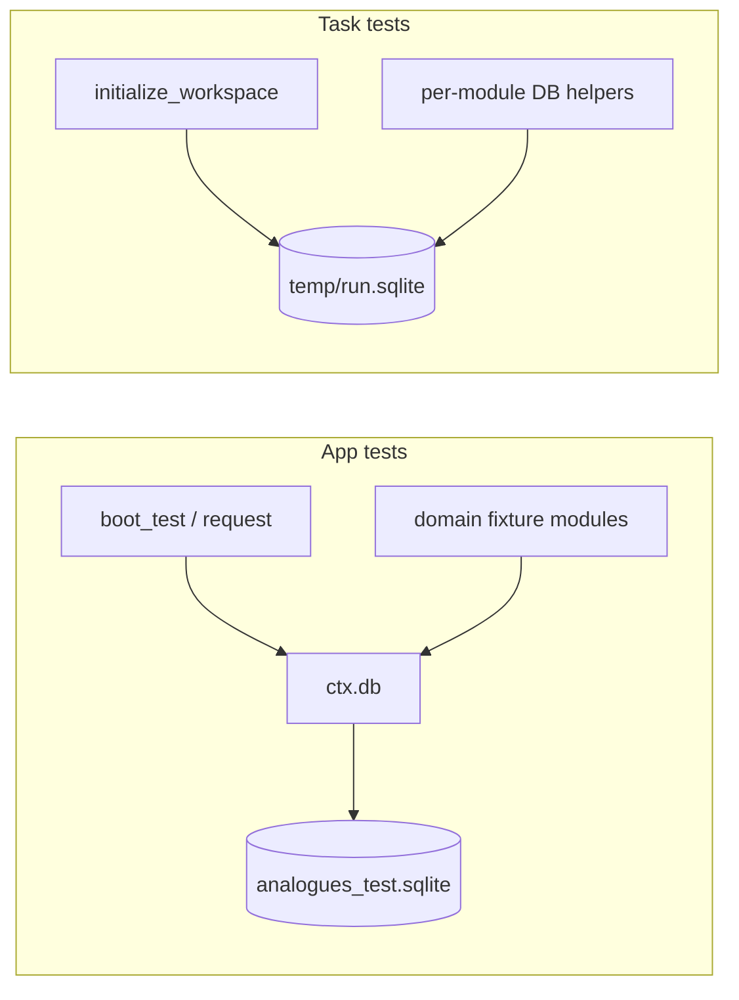

# Advanced SQLite Testing Options

This document follows [`06-07-001-sec-raw-facts-rust-vs-sql-analysis.md`](06-07-001-sec-raw-facts-rust-vs-sql-analysis.md), which argued that some `concept_catalog.rs` logic could move into SQL views while policy-heavy code should stay in Rust. That analysis leaned on a familiar claim: **Rust transforms are easier to unit test than SQL**.

That claim is often true in the abstract, but it is incomplete. Teams that invest in **testable SQLite** can get comparable confidence for views, window functions, deduplication rules, and migration correctness — often with better alignment to how the data is actually queried in production. The trade is not “SQL instead of tests.” It is **a different testing stack**: schema fixtures, assertion SQL, migration harnesses, and CI pipelines that treat the database as a first-class test surface.

This document surveys how that investment typically looks, with references to engineering write-ups and tooling patterns, and closes with recommendations for this repository.

---

## Reframing “Rust Is More Testable”

The Rust advantage is real for certain classes of logic:

| Rust-friendly | SQL-friendly |
| --- | --- |
| Multi-step policy with branches and quality flags | `ROW_NUMBER()`, `GROUP BY`, joins, filters |
| LLM orchestration and scoring heuristics | Deduped “latest fact per period” views |
| Contiguous TTM window validation with clear fixtures | Period-shape classification from `duration_days` |
| Pure functions with small typed inputs | Aggregations over seeded `sec_raw_facts` rows |

The mistake is treating “testability” as a property of the **language** rather than the **test harness**. Rust unit tests are ergonomic because `cargo test` is one command away. SQL logic becomes testable when a team builds the equivalent harness: isolated databases, repeatable schema application, fixture seeding, and assertions that fail CI with actionable diffs.

In other words:

- **Untested SQL in views** is harder to maintain than tested Rust.
- **Tested SQL in views** can be *more* faithful than Rust that duplicates the same logic in memory and only persists the output.

The goal of a “testable SQLite” investment is to make the second case cheap.

---

## What Teams Usually Mean by “Testable SQLite”

Across blog posts, migration tooling docs, and analytics-engineering practice, “testable database” work tends to split into **five layers**. Mature teams implement several layers at once; early teams often start at layers 1–3.



### Layer 1: Schema and migration tests

**Question answered:** “Did we apply the schema we think we applied?”

Patterns:

- Apply the **same migration SQL** used in production to a fresh `:memory:` or temp-file database before each test suite (or once per template clone).
- Run a **dedicated migration test** that applies migrations sequentially and asserts object existence — separate from behavioral tests. Microsoft’s EF Core guidance makes this distinction explicit: use fast schema materialization for most tests, but keep migration validation in its own test class when migration scripts themselves are the subject under test ([EF Core SQLite in-memory testing](https://www.dotnet-guide.com/articles/ef-core-sqlite-inmemory-testing/)).
- Track applied migrations in a `schema_migrations` table so upgrade paths are testable.

**Sqitch “verify” scripts** are a related but narrower idea. David Wheeler’s Sqitch design separates:

- **Verify scripts** — prove a deploy step succeeded (e.g., table exists); safe to run against production; should not assume test data ([Sqitch verify docs](https://sqitch.org/docs/manual/sqitch-verify/), [Trust, But Verify](https://justatheory.com/2013/01/sqitch-trust-but-verify/)).
- **Unit tests** (often pgTAP in Postgres) — prove business logic and schema behavior against a disposable database; run as a **separate CI step** after deploy ([Sqitch + pgTAP discussion](https://groups.google.com/g/sqitch-users/c/DAIzwMz1O5I)).

For SQLite-first apps without Sqitch, the same separation applies:

| Test type | Example |
| --- | --- |
| Structural verify | `SELECT 1 FROM sqlite_master WHERE name = 'sec_raw_facts_deduped' AND type = 'view'` |
| Behavioral unit test | Seed 4 quarterly revenue rows; assert TTM view sums correctly |

GitLab’s migration testing guide is another large-scale example: migrations that transform data must have specs that roll back to a prior version, seed data, run the migration, and assert outcomes ([GitLab migration testing guide](https://docs.gitlab.com/development/testing_guide/testing_migrations_guide/)).

### Layer 2: View and query logic tests

**Question answered:** “Does this view/query return the right rows for known inputs?”

This is where advanced SQLite features — views, window functions, CTEs, `json_each`, generated expressions — get direct test coverage.

Common approaches:

#### A. Application-hosted SQL tests (most common for SQLite)

Spin up `:memory:` (or a temp file), apply schema, seed minimal rows, run `SELECT` against the view, assert on result sets in Rust/Python/JS tests.

The Bun SQLite testing write-up captures the ethos: don’t mock the DB layer for SQL correctness; run real migration files against `:memory:` in `beforeEach` and assert query results ([Bun SQLite testing](https://helpmetest.com/blog/bun-sqlite-testing/)). The tests feel like integration tests but run at unit-test speed.

#### B. SQL-native assertion frameworks

Postgres has **pgTAP** — TAP-emitting assertion functions (`ok()`, `is()`, `results_eq()`) run via `pg_prove` ([pgTAP](https://github.com/theory/pgtap), [AWS pgTAP blog](https://aws.amazon.com/blogs/database/create-a-unit-testing-framework-for-postgresql-using-the-pgtap-extension/)). SQLite has smaller equivalents:

- **[sqlite-unit](https://github.com/mrwilson/sqlite-unit)** — minimal TAP-compatible `assert_equal`, `assert_null` as SQL functions.
- **[sqlite-assert](https://github.com/asg017/sqlite-assert)** — assertion helpers loadable as an extension (Rust/Python/Go bindings).
- **[RDBUnit](https://github.com/dspinellis/rdbunit)** — declarative files specifying setup tables, query under test, and expected result tables; supports SQLite via piping to `sqlite3`.

These are niche compared to pgTAP but illustrate the pattern: **keep assertions close to SQL** when the SQL is the product.

#### C. Analytics-style “unit tests for SQL” (dbt)

Even outside SQLite, the **dbt 1.8+ unit test** model is the clearest industry articulation of “test the transformation, not the warehouse”:

- **Unit tests** — mocked inputs (`given` / `expect` rows); run in CI on code changes; validate CASE/WHEN, window logic, date math ([dbt unit tests](https://docs.getdbt.com/docs/build/unit-tests), [unit vs data tests](https://adriennevermorel.com/notes/unit-tests-vs-data-tests-in-dbt/)).
- **Data tests** — assertions against materialized data (`unique`, `not_null`, custom SQL returning failing rows); run on every build.

For a Rust/Loco app with SQLite views, the dbt mental model maps cleanly:

| dbt concept | Analogues analogue |
| --- | --- |
| Unit test with mocked `ref()` inputs | Seed 10-row `sec_raw_facts` fixture; query view |
| Singular data test | `SELECT * FROM ... WHERE violation` must return 0 rows |
| Generic data test | Every `canonical_key` in mappings has ≥1 matching raw fact |

You do not need dbt itself; you need the **separation of logic tests (fixtures) from health tests (invariants)**.

### Layer 3: Constraint and invariant tests

**Question answered:** “Do our declared rules actually hold?”

Explicit tests worth having for financial SQLite:

- `PRAGMA foreign_keys = ON` on every connection (frequently forgotten in CI; called out in Bun and EF Core SQLite guides).
- `CHECK (json_valid(raw_json))` on `sec_raw_facts` rejects bad payloads.
- Unique constraints on `(canonical_key, taxonomy, concept_name, unit)` in mappings.
- **Invariant queries** run after init: no duplicate “latest” rows per canonical period; `fundamental_observations` period_end ordering; orphaned mappings.

These are cheap “data tests” in the dbt sense: SQL that returns rows = failure.

### Layer 4: Application integration tests

**Question answered:** “Does the Rust code that *uses* SQL produce correct end state?”

This is where Rust testing remains essential even in a SQL-first architecture:

- `initWorkspace` with `fetch_financials = false` (current pattern in `tests/tasks/init_workspace.rs`).
- Init with mocked SEC provider → assert row counts and headline metrics.
- `generate_report` reading `canonical_fundamental_observations`.

The Hacker News thread [“Database mocks are not worth it”](https://news.ycombinator.com/item?id=42552976) summarizes a widely repeated compromise: **SQLite `:memory:` for fast, non-mocked tests** during development; periodic runs against the real production engine when SQLite is a stand-in for Postgres. For Analogues, SQLite *is* production for per-run workspaces, so this caveat is less severe — but the **“don’t mock the DB for SQL you care about”** principle still applies.

### Layer 5: Golden workspace / regression tests

**Question answered:** “Did we change behavior on a real company’s fact set?”

`docs/qa/06-06-002-phase-5-sqlite3-orcl-analysis.md` is an example of manual golden exploration. Automated regression would:

- Commit a **redacted fixture** (`tests/fixtures/orcl-sec-facts-slice.sqlite` or SQL seed files).
- Run canonical selection + view queries.
- Compare headline metrics and selected observation counts to expected JSON.

This layer is expensive but catches subtle period-alignment regressions that unit fixtures miss.

---

## Test Isolation: The Hidden Enabler

Advanced SQL tests fail in CI if tests share mutable database state. SQLite’s architecture makes isolation unusually cheap.

### Per-test `:memory:` database

The default pattern: each test opens `sqlite::memory:`, applies schema, seeds, asserts, drops.

Curling IO’s write-up ([Test Isolation for Free with SQLite](https://curling.io/blog/sqlite-test-isolation)) goes further for large schemas:

1. Build schema once into a **template** in-memory DB at suite startup.
2. **Clone** it per test with SQLite’s **backup API** (page-level copy, ~25µs vs ~1ms re-running 77 DDL statements).
3. No transaction rollback gymnastics; no `database_cleaner`.

They report ~500 DB-backed tests with schema clone overhead negligible vs business logic. The pattern is language-agnostic — Python `Connection.backup()`, Rust `rusqlite::backup`, Node `better-sqlite3` ([Curling IO article](https://curling.io/blog/sqlite-test-isolation)).

For Analogues, where `init_workspace.rs` defines dozens of tables and views, template cloning is worth adopting once view tests multiply.

### Transaction rollback (alternative)

Wrap each test in `BEGIN … ROLLBACK` against a shared file or memory DB. Faster when schema is huge and cloning is unavailable, but breaks down when:

- Code under test calls `COMMIT` (init workspace uses real transactions).
- Triggers or pragmas behave differently inside rolled-back transactions.

Init-path tests likely need **fresh DB per test** or template clone, not rollback.

---

## CI Layout: How Mature Teams Wire This

A typical pipeline for a SQLite-centric app:

```text
1. cargo test (Rust unit tests — provider parsing, scoring heuristics, policy)
2. cargo test --test sql_views     (in-memory schema + seeded view tests)
3. cargo test --test init_workspace (integration — full init path)
4. optional: sqlite3 < tests/sql/invariants.sql  (fail on any output)
5. optional: golden regression on fixture workspace DB
```

Key practices from the sources above:

| Practice | Source |
| --- | --- |
| Same DDL/migrations in tests as production | Bun SQLite testing, Curling IO |
| Separate migration verification from behavior tests | EF Core guide, Sqitch verify vs pgTAP |
| Never mock SQL you rely on for correctness | HN thread, Bun article |
| `PRAGMA foreign_keys=ON` on every connection | Bun, EF Core SQLite |
| Logic tests use small fixtures; health tests use invariants | dbt unit vs data tests |
| Keep verify/deployment checks production-safe | Sqitch docs |

---

## Advanced SQLite Features: What Changes in Test Design

Moving logic into views does not remove the need for tests — it shifts **where** tests live and **what** they assert.

| Feature | Testing implication |
| --- | --- |
| **Views** | Seed base tables; `SELECT * FROM view` equals expected result set. Cannot insert into view unless `INSTEAD OF` trigger — tests target underlying tables. |
| **Window functions** (`ROW_NUMBER`, etc.) | Fixture must include **duplicate** `(period_end, filed_at)` rows to prove dedupe tie-breaks. |
| **CTEs** | Test the view or final `SELECT`; optionally snapshot `EXPLAIN QUERY PLAN` in perf regression suite only. |
| **Generated / derived columns** | Assert at insert time; view tests assume column present. |
| **JSON columns** (`period_shape_counts`) | `json_each` invariant tests or assert in Rust after load. |
| **Triggers** | Insert/update fixtures; assert side effects (rare in current Analogues schema). |
| **FTS / extensions** | Load extension in test harness same as production; separate CI job if extension build is heavy. |

### Window-function dedupe: minimal fixture pattern

Equivalent to `latest_value_fact` in SQL:

```sql
-- Fixture: two filings for same period; later filed_at should win
INSERT INTO sec_raw_facts (taxonomy, concept_name, unit, period_end, filed_at, metric_value, raw_json, fetched_at)
VALUES
  ('us-gaap', 'Revenues', 'USD', '2025-12-31', '2026-02-01', 100.0, '{}', '2026-01-01'),
  ('us-gaap', 'Revenues', 'USD', '2025-12-31', '2026-03-01', 101.0, '{}', '2026-01-01');

-- View under test should return metric_value = 101.0 for that period
```

Tests like this are **more direct** than testing through `ConceptCatalog::latest_value_fact` because they assert the contract consumers (SQL explorers, report queries) actually use.

### TTM / multi-step logic: fixture tables

Contiguous TTM logic needs **four** quarterly rows with specific `period_start`/`period_end` spans. Maintain these as:

- `tests/fixtures/sql/ttm_revenue_contiguous.sql` (seed)
- `tests/fixtures/sql/ttm_revenue_gap.sql` (negative case — gap should exclude window)

This is more verbose than Rust unit tests but **documents the contract** for anyone reading SQL.

---

## Case Studies and Posture Summaries

### Curling IO — SQLite as production and test DB

- **Posture:** In-process SQLite eliminates shared-server isolation problems.
- **Technique:** Template DB + backup API clone per test.
- **Lesson:** Schema execution cost is real at scale; page-level clone beats re-running DDL.
- **Caveat:** Only applies when production is also SQLite ([article](https://curling.io/blog/sqlite-test-isolation)).

### Sqitch + pgTAP (Postgres, but pattern-portable)

- **Posture:** Deploy/verify/revert are operational; unit tests are developmental.
- **Technique:** `sqitch deploy --verify` then `pg_prove` separately.
- **Lesson:** Don’t overload production verify scripts with full unit test suites.
- **Port to SQLite:** `init_workspace` DDL as deploy artifact; `tests/sql/*.sql` as pg_prove-equivalent run via `sqlite3` exit code.

### dbt — analytics SQL testing maturity model

- **Posture:** Unit tests for logic (CI), data tests for health (every run).
- **Technique:** YAML `given`/`expect` fixtures; singular SQL tests returning failing rows.
- **Lesson:** ~5–10% of models need unit tests — the complex transforms. Same applies to financial views: test `sec_raw_facts_deduped` and `ttm_candidates`, not every `SELECT COUNT(*)`.

### GitLab — migration tests at scale

- **Posture:** Data migrations must have specs; tag `:migration`; no transaction wrapper by default.
- **Technique:** Roll back to version N-1, seed, migrate, assert.
- **Lesson:** Migration tests are integration tests worth explicit investment when schema evolves across many run DBs.

### Neon — counterargument (Postgres-as-test-DB)

- **Posture:** SQLite tests can mask Postgres behavior (types, concurrency, JSON operators).
- **Technique:** Ephemeral Postgres branches per CI job.
- **Relevance to Analogues:** Low for per-run SQLite workspaces; higher if the app later adds a shared Postgres service. Worth remembering if SQL logic is copied between engines.

### Community consensus (HN / EF Core)

- **Mocks** of query layers hide SQL bugs.
- **SQLite `:memory:`** is a sweet spot: near unit-test speed, real constraints.
- **Repository mocking** tests business logic when SQL is trivial; **in-memory SQLite** tests SQL when logic lives in the database.

---

## Current Testing Infrastructure

Analogues already runs real SQLite in tests. The infrastructure is split across **two databases** with different boot paths and different degrees of shared utility code.

### App database path (`tests/models/`, `tests/requests/`)

Loco’s testing prelude (`boot_test`, `request`) boots the application against `config/test.yaml`:

```yaml
# config/test.yaml (abbreviated)
database:
  uri: sqlite://analogues_test.sqlite?mode=rwc
  auto_migrate: true
  dangerously_truncate: true
  dangerously_recreate: true
```

Each boot applies SeaORM migrations to a truncated SQLite file. Tests receive a live `ctx.db` and exercise the ORM or raw SQL without mocks. Request tests follow a consistent shape: `request::<App>` provides the HTTP client and app context; domain-specific fixture modules (for example `tests/requests/prepare_data.rs` for authenticated users) seed the state a scenario needs.

This path demonstrates the pattern this document advocates elsewhere: **isolated database, real DDL, small fixture helpers, no mocked query layer**. It targets the Loco app schema (users, auth, etc.), not per-run workspace data.

### Workspace database path (`tests/tasks/`)

Task tests exercise the research pipeline’s `run.sqlite` schema. They call `initialize_workspace` directly, create a workspace under a temp directory, and open the resulting database with helpers defined inline in each test module:

| Helper | Typical location | Role |
| --- | --- | --- |
| `temp_report_root()` | `tests/tasks/*.rs` | Unique temp workspace root per test |
| `open_run_db` / `open_run_db_rw` | same | Connect to `run.sqlite` |
| `scalar_string`, `scalar_i64` | `init_workspace.rs` tests | Assert single SQL values |
| `execute_sql`, `seed_minimum_report_data` | `generate_report.rs` tests | Insert seed rows for report scenarios |

These tests cover workspace DDL application, metadata seeding, and report generation end-to-end. They also use real SQLite and real SQL assertions. Compared with the app path, they rely on **on-disk temp files** rather than truncate/recreate, **duplicate** connection helpers across modules, and **inline** seed SQL rather than shared fixture files.



### Implications for SQL-first workspace logic

Financial views and `sec_raw_facts` invariants belong on the **workspace path**. The app `ctx.db` uses a different schema; view tests should target `run.sqlite` DDL and tables such as `sec_raw_facts`, `canonical_metric_mappings`, and `fundamental_observations`.

The near-term gap is not the absence of SQLite testing — it is **consolidation on the workspace side**: shared helpers, reusable seed fixtures, and (optionally) `:memory:` or backup-clone optimization for view-only tests that do not need a full workspace directory tree.

---

## Recommended Investment for This Repository

| Area | Status |
| --- | --- |
| App SQLite isolation (`boot_test`, truncate/recreate) | In place |
| Domain fixture modules for request tests | In place (auth) |
| Workspace schema integration tests | In place (`tests/tasks/init_workspace.rs`) |
| Workspace SQL seeding for report tests | In place (`seed_minimum_report_data`) |
| Shared workspace test utilities | Not yet — helpers duplicated per module |
| View / `sec_raw_facts` SQL tests | Not yet |
| Golden workspace regression | Manual only (see `06-06-002`) |

If the team moves SQL-ward per `06-07-001`, extend what already exists rather than introducing a parallel harness.

### Phase A — Consolidate workspace test support

1. Add `tests/support/workspace_db.rs` and move duplicated helpers from task tests: `temp_report_root`, `open_run_db`, `open_run_db_rw`, `scalar_*`, `execute_sql`.
2. Optionally add `open_memory_workspace_db()` that applies the same DDL as `initialize_workspace` to `:memory:` for faster view-only tests.
3. Extract workspace DDL from `init_workspace.rs` into a shared constant or `tests/support/workspace_schema.sql` so init and view tests share one definition.
4. Enable `PRAGMA foreign_keys = ON` on workspace test connections.
5. Add workspace fixture modules or SQL seed files (for example under `tests/fixtures/sql/`) following the same pattern as request-test fixture modules.

### Phase B — First view tests (ongoing)

For each promoted view (e.g. `sec_raw_facts_deduped`, `latest_canonical_fact`):

1. Add seed SQL fixture with positive and negative cases.
2. Add `#[test] fn deduped_facts_prefers_latest_filing()` querying the view.
3. Add invariant SQL file: `tests/sql/invariants/canonical_mappings_have_facts.sql` — CI fails if any row returned.

### Phase C — Rust policy tests stay

Keep `ttm_windows`, `select_latest_income_bundle`, LLM review, and quality-flag tests in Rust **until** parity-proven SQL views exist. Then add **parity tests**:

```rust
#[test]
fn ttm_view_matches_rust_policy_on_fixture() {
    let rust = ttm_windows(...);
    let sql = query_ttm_view(&db, "revenue");
    assert_eq!(rust, sql);
}
```

Parity tests are the bridge during migration; delete Rust or SQL duplicate once stable.

### Phase D — Golden regression (optional)

- Small frozen SEC fact slice (MSFT or ORCL, ~500 rows) in `tests/fixtures/`.
- Assert stable headline metrics after init — catches real-world regressions fixtures miss.

### Phase E — CI wiring

```yaml
# illustrative
- run: cargo test
- run: cargo test --test sql_views
- run: |
    sqlite3 :memory: < tests/sql/run_invariants.sql
    # script exits non-zero if any invariant SELECT returns rows
```

---

## Costs and Benefits of “Testable SQLite”

### Benefits

| Benefit | Detail |
| --- | --- |
| **Single definition of truth** | View tests assert what agents and reports query. |
| **Inspectable failures** | `SELECT` diff is often clearer than debugging struct transforms. |
| **Supports SQL-first direction** | Reduces fear of moving logic from `concept_catalog.rs`. |
| **Fast CI** | `:memory:` and backup cloning keep feedback loops sub-second per test. |
| **Documentation by example** | Fixture SQL files encode period semantics for future contributors. |

### Costs

| Cost | Detail |
| --- | --- |
| **Harness engineering** | Schema sharing, cloning, seed management upfront. |
| **Fixture maintenance** | Financial edge cases need explicit rows (amended filings, YTD vs quarter). |
| **Weaker IDE ergonomics** | SQL strings lack Rust’s type checking; sqlfluff/lite linting helps. |
| **Duplication during migration** | Parity tests between Rust and SQL temporarily increase suite size. |
| **No pgTAP-equivalent maturity** | sqlite-unit/sqlite-assert are small; most teams use host-language assertions. |

### When the investment is worth it

Worth it when:

- Views become the **primary API** for fundamentals and Phase 5 mechanics.
- Multiple contributors run ad hoc SQL against run databases.
- Rust and SQL implementations risk **drift** (the current trajectory).

Defer when:

- Logic is still churning weekly in Rust — stabilize contracts first.
- Only one or two headline queries move to SQL — host-language tests suffice.

---

## Recommended Testing Split for Analogues

| Layer | Technology | Examples |
| --- | --- | --- |
| SEC JSON extraction | Rust unit tests + fixtures | `sec_facts_provider` |
| Canonical scoring / LLM review | Rust unit/integration tests | `concept_catalog`, `concept_review` |
| Deduped facts, period typing, canonical joins | SQLite view tests + fixtures | future `sec_raw_facts_deduped` |
| TTM / income bundle policy | Rust tests + optional SQL parity | `ttm_windows`, `select_latest_income_bundle` |
| Schema/migrations | DDL apply test + `sqlite_master` assertions | extend `init_workspace` tests |
| Invariants | Singular SQL tests (0 rows = pass) | mapping coverage, JSON validity |
| End-to-end | Init + generate_report integration | existing tests |
| Real-world regression | Golden workspace slice | optional MSFT/ORCL fixture |

---

## Bottom Line

“Rust is more easily testable” is true for **orchestration and policy**, not an argument against SQL views. Teams that lean on advanced SQLite typically:

1. **Stop mocking** the database for logic they depend on.
2. **Isolate** with `:memory:` or backup-cloned templates.
3. **Apply real DDL** in tests.
4. **Separate** structural verify checks from behavioral unit tests (Sqitch/dbt lesson).
5. **Seed minimal fixtures** and assert view outputs — or use RDBUnit/sqlite-assert for SQL-native style.
6. **Keep Rust tests** for LLM flows, scoring, and multi-step policy until SQL parity is proven.

For Analogues, the highest-leverage first step is not a new assertion framework — it is to **consolidate workspace test helpers** into `tests/support/` and add seeded `SELECT` tests against the first promoted views. The app-test path already shows the target shape: isolated SQLite, real schema, small fixture modules. The workspace path needs the same discipline applied to `run.sqlite` and `sec_raw_facts` seeds.

---

## References

| Resource | Topic |
| --- | --- |
| [Curling IO — Test Isolation for Free with SQLite](https://curling.io/blog/sqlite-test-isolation) | Template DB + backup API cloning |
| [Bun SQLite Testing](https://helpmetest.com/blog/bun-sqlite-testing/) | Migrations in `beforeEach`, what to test |
| [Sqitch verify manual](https://sqitch.org/docs/manual/sqitch-verify/) | Deploy verification vs unit tests |
| [Sqitch + pgTAP thread (David Wheeler)](https://groups.google.com/g/sqitch-users/c/DAIzwMz1O5I) | Keep verify and unit tests separate |
| [dbt unit tests](https://docs.getdbt.com/docs/build/unit-tests) | Logic tests with mocked inputs |
| [Unit vs data tests (Adrienne Vermorel)](https://adriennevermorel.com/notes/unit-tests-vs-data-tests-in-dbt/) | Two test categories |
| [RDBUnit](https://github.com/dspinellis/rdbunit) | Declarative SQL query tests |
| [sqlite-unit](https://github.com/mrwilson/sqlite-unit) | TAP assertions in SQLite |
| [sqlite-assert](https://github.com/asg017/sqlite-assert) | Assertion extension |
| [pgTAP](https://github.com/theory/pgtap) | Mature SQL testing (Postgres reference model) |
| [GitLab migration testing guide](https://docs.gitlab.com/development/testing_guide/testing_migrations_guide/) | Data migration specs |
| [EF Core SQLite testing](https://learn.microsoft.com/en-us/ef/core/testing/testing-without-the-database) | In-memory patterns and caveats |
| [HN — Database mocks are not worth it](https://news.ycombinator.com/item?id=42552976) | SQLite as test sweet spot |
| [Neon — Testing SQLite as Postgres user](https://neon.com/blog/testing-sqlite-postgres) | Counterpoint when engines differ |
| [`06-07-001-sec-raw-facts-rust-vs-sql-analysis.md`](06-07-001-sec-raw-facts-rust-vs-sql-analysis.md) | SQL-first migration context for this repo |
| [`06-06-002-phase-5-sqlite3-orcl-analysis.md`](06-06-002-phase-5-sqlite3-orcl-analysis.md) | Manual SQL exploration precedent |
