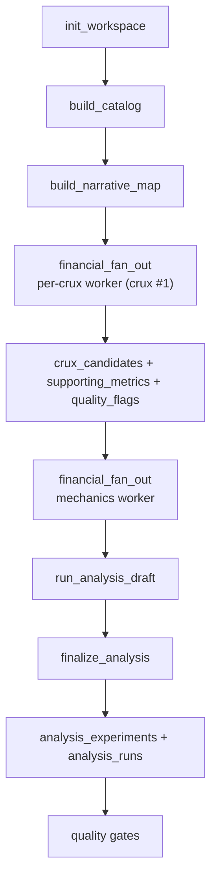

# Financial Fan-Out & Init Workspace QA — ORCL Run 24

## Scope

QA inspection of **init workspace substrate**, **narrative researcher output**, and the new **`financial_fan_out` lane** (per-crux parallel crux triage + scout + single mechanics pass) for one Oracle run. Compared against prior ORCL financial exploration reports `06-13-012` (run 20) and `06-13-013` (runs 20 vs 21).

| Run | SQLite path | Lane architecture | Financial explorer workers |
|-----|-------------|-------------------|----------------------------|
| **24** | `reports/stock-narrative-research/ORCL-2026-06-13-24/run.sqlite` | `financial_fan_out` (9 per-crux + 1 scout + 1 mechanics) | 11 |
| 21 | `reports/stock-narrative-research/ORCL-2026-06-13-21/run.sqlite` | `identify_crux_candidates` + `financial_mechanics_experiments` | 2 |
| 20 | `reports/stock-narrative-research/ORCL-2026-06-13-20/run.sqlite` | Same as 21 | 2 |

Model for all workers: `deepseek/deepseek-v4-flash`.

Web validation: [Oracle Q4/FY2026 press release](https://investor.oracle.com/investor-news/news-details/2026/Oracle-Announces-Record-Q4-and-FY-2026-Results-Driven-by-Cloud-Infrastructure--Cloud-Applications/default.aspx), 8-K, CNBC (June 2026).

Worker telemetry (run 24):

| Worker | Rounds | Tool calls | Cost | Latency |
|--------|--------|------------|------|---------|
| `narrative_researcher` | 13 | 30 | ~$0.064 | ~212s |
| `financial_model_explorer` (9× per-crux triage) | 129 | 301 | ~$0.175 | ~1,947s |
| `financial_model_explorer` (scout triage) | — | — | (included above) | — |
| `financial_model_explorer` (mechanics) | 15 | 23 | ~$0.024 | ~233s |
| **Financial explorer total** | **154** | **358** | **~$0.215** | **~2,180s** |

For comparison, run 21 financial explorer total: 43 rounds / 79 tool calls / ~$0.078 / ~599s.

## Verdict

**Partial pass — fan-out crux triage is a major structural win (full narrative coverage, supporting metrics, and persisted staleness flags), but the single mechanics pass does not scale with triage breadth. Experiment coverage regressed vs run 21 while cost roughly tripled.**

Run 24 is the first ORCL run using `financial_fan_out`: each narrative crux gets a dedicated crux-triage agent, plus a scout agent for SEC-discoverable mechanics the narrative missed. The result is **11 promoted crux candidates** (9 narrative-aligned + 2 scout discoveries), **30 supporting metrics with rationale**, **27 `data_quality_flags`** (addressing the staleness gap flagged in `06-13-013`), and **31 `data_gaps`**. All **26 quality gates pass**.

The mechanics worker still runs **once** after fan-out and produced only **3 promoted experiments** attached to **3 of 11 cruxes** — with **no `forward_projection`** (run 21 had one). Gates pass because `rpo_conversion_sensitivity_fy27` satisfies `experiment_purpose_diversity`, but eight promoted cruxes have zero experiments. Init workspace quality is unchanged from run 21: **partial** (`starter_financials` gap for price/market cap; SEC facts through Q3 FY2026).

Narrative layer adds breadth (25 claims) but introduces a **material arithmetic error** on Q4 revenue growth (claim #1 cites 11% YoY vs ~21% reported).

---

## Fan-Out Architecture vs Prior Runs

### What changed

`financial_fan_out` (`src/lanes/financial_fan_out.rs`) spawns one `financial_model_explorer` worker per `narrative_map_items` crux row, each with a `FOCUS:` prompt prefix, plus one **scout** worker (`SCOUT_PREFIX`) for dilution/obligation mechanics not on the narrative board. Results merge via `persist_crux_triage`. A single mechanics worker then runs `FinancialModelExplorerConfig::mechanics_experiment()`.

### Triage comparison

| Dimension | Run 20 | Run 21 | Run 24 |
|-----------|--------|--------|--------|
| Lane | identify_crux + mechanics | identify_crux + mechanics | **financial_fan_out** |
| Narrative crux items | 7 | 8 | **9** |
| Promoted `crux_candidates` | 1 | 4 | **11** |
| Scout-discovered cruxes | 0 | 0 | **2** (`dilution_already_in_progress`, `obligation_stack_build`) |
| `supporting_metric_selections` | 0 | 6 | **30** |
| `data_quality_flags` | 0 | 0 | **27** |
| `data_gaps` (total) | 3 | 3 | **31** |
| Distinct bridge archetypes | 1 | 4 | **5** |
| Crux triage agent rounds | 12 | 23 | **129** (parallel) |
| Financial explorer cost | ~$0.040 | ~$0.078 | **~$0.215** |

Fan-out delivers what `06-13-013` asked for on triage completeness: every narrative crux has a promoted mechanic, scout finds off-board obligation/dilution threads, supporting metrics are auditable, and SEC-vs-claim staleness is persisted in `data_quality_flags` instead of only living in experiment prose.

### Experiment comparison

| Dimension | Run 20 | Run 21 | Run 24 |
|-----------|--------|--------|--------|
| Promoted experiments | 3 | 4 | **3** |
| Background experiments | 1 | 0 | **1** |
| `forward_projection` | 0 | 1 (`capex_funding_gap_forward_projection`) | **0** |
| `sensitivity` | 0 | 1 (`rpo_conversion_funding_sensitivity`) | **1** (`rpo_conversion_sensitivity_fy27`) |
| `historical_investigation` | 3 | 2 | **2** |
| Cruxes with promoted experiments | 1 | 3–4 | **3** (crux ids 1, 3, 8) |
| Cruxes with promoted experiments / total promoted | 1/1 | 4/4 | **3/11** |
| `analysis_runs` (finalized) | 4 | 4 | **4** |
| Orphan `draft` runs | 0 | 2 | **0** |

**Regression:** Run 24's richer triage layer is not matched by experiment breadth. The mechanics agent appears to optimize for gate minimums (≥2 promoted, ≥1 sensitivity/forward when guidance claims exist) rather than distributing experiments across the 11 promoted cruxes.

### Promoted crux → experiment coverage (run 24)

| Crux | Key | Promoted exps | Notes |
|------|-----|---------------|-------|
| 1 | `rpo_conversion_to_capex_justification` | 1 | `rpo_conversion_sensitivity_fy27` |
| 2 | `ai_infra_roic_target` | 0 | ROIC proxy not modeled despite supporting metrics on op income + PPE |
| 3 | `fcf_debt_flexibility` | 1 | `capex_ocf_funding_gap_annual` |
| 4 | `oci_growth_sustainability` | 0 | Claim-only OCI growth; no hybrid experiment |
| 5 | `post_earnings_decline_signal` | 0 | No price/mcap in workspace limits dilution math |
| 6 | `ai_contract_conversion_timeline` | 0 | RPO conversion trend backgrounded, not promoted |
| 7 | `stranded_asset_risk_ai_capex` | 0 | PP&E/CIP supporting metrics unused in experiments |
| 8 | `capex_funding_pressure` | 1 | `interest_coverage_squeeze_annual` |
| 9 | `multicloud_cannibalization` | 0 | Claim-only multicloud growth |
| 10 | `dilution_already_in_progress` (scout) | 0 | Preferred stock + shares supporting metrics unused |
| 11 | `obligation_stack_build` (scout) | 0 | Purchase obligations + debt issuance unused |

---

## What The Workspace Captures Well

### Init substrate (unchanged vs run 21)

| Artifact | Run 24 | Status |
|----------|--------|--------|
| `sec_raw_facts` | 25,369 rows | Broad SEC universe |
| Distinct SEC concepts | 513 | Suitable for niche discovery |
| `concept_catalog_entries` | 516 | Tagged, searchable |
| `fundamental_observations` | 807 | Rich time series |
| `canonical_metric_mappings` | 9 | AV-backed core metrics |
| `av_raw_facts` | 5,643 | Alpha Vantage fundamentals |
| `revenue_ttm` (AV) | $67.358B (2026-05-31) | Matches FY2026 release |
| `shares_outstanding` | 2.876B | Consistent with SEC instant facts |
| `total_debt` (AV) | $156.2B | Aligns with narrative leverage theme |
| Latest SEC `period_end` (RPO, OCF, capex) | 2026-02-28 (Q3 FY2026) | Expected filing lag |

### New in run 24 — staleness and gap persistence

Run 24 is the first ORCL run to populate `data_quality_flags` at scale. Representative flags:

- `sec_facts_stale_Q4_FY2026`, `sec_rpo_q4_stale` — RPO/OCF/capex SEC series end Q3 while claims cite Q4 FY2026.
- `sec_filing_lag_fy2026` — FY2026 10-K not filed.
- `debt_instrument_underreporting` — `DebtInstrumentCarryingAmount` ($43B) vs narrative $156B total debt.
- `depreciation_headwind_building` — YTD depreciation surge observation.

This directly addresses recommendation #2 from `06-13-013` ("Add staleness enforcement"). Downstream agents can now query flags instead of inferring staleness from experiment assumptions alone.

### Fan-out triage strengths

- **Scout discoveries are valuable:** `obligation_stack_build` surfaces `UnrecordedUnconditionalPurchaseObligationBalanceSheetAmount` ($11B+) — a concept the narrative board did not crux explicitly.
- **Supporting metrics are crux-scoped:** 30 rows with `rationale`, `period_basis`, and `quality_status` (including `warning` on stale debt concepts).
- **Falsifiability:** All 11 promoted cruxes include watch/confirming/breaking signals.
- **Bridge diversity:** `backlog_to_cash_conversion`, `capex_to_funding_pressure`, `obligation_build`, `dilution_risk`.

### Mechanics experiments that work

| Key | Purpose | Assessment |
|-----|---------|------------|
| `capex_ocf_funding_gap_annual` | historical | Sound SEC arithmetic through FY2025; correctly identifies capex/OCF flip (1.019× FY2025). Interpretation cites ~$47B forward gap at guided capex. Ends at FY2025 SEC — understates FY2026 intensity ($55.7B capex / $32.0B OCF per release). |
| `interest_coverage_squeeze_annual` | historical | Coverage 4.94× FY2025; interpretation incorporates $44.5B YTD debt issuance and forward compression scenario. |
| `rpo_conversion_sensitivity_fy27` | sensitivity | Implied ~8.5% conversion to close $47B gap using Q3 RPO $552.6B; documents staleness in assumptions. Brackets funding mechanics honestly. |
| `rpo_conversion_velocity_trend` | background | Reasonable demotion — historical conversion series overlaps sensitivity experiment. |

All four `analysis_runs` are `finalized` (no orphan drafts — improvement over run 21).

---

## Data Quality Findings

| Severity | Finding | Where | Suggested fix |
|----------|---------|-------|---------------|
| **High** | Q4 revenue growth misstated as 11% YoY | `claims` #1 | Official Q4 FY2026 revenue growth is ~21% YoY ($19.2B vs ~$15.9B). Narrative gate should validate claim arithmetic against known headline figures or flag for review. |
| **High** | 8/11 promoted cruxes have zero experiments | `crux_candidates` vs `analysis_experiments` | Fan-out triage outpaces mechanics. Options: per-crux mini-mechanics workers, experiment budget gate tied to promoted crux count, or mechanics prompt listing uncovered crux keys. |
| **High** | No `forward_projection` despite FY27 capex guidance | `analysis_experiments` | Run 21's `capex_funding_gap_forward_projection` addressed this; run 24 regressed. Gate passes on sensitivity alone — consider requiring forward when claims include multi-year capex guides. |
| **High** | Sensitivity uses Q3 RPO ($552.6B), not Q4 ($638B) | `rpo_conversion_sensitivity_fy27` | Flags document staleness; arithmetic still understates implied conversion rate (~7.4% at $638B base vs ~8.5%). Dual-base sensitivity recommended. |
| **High** | Forward OCF baseline ~$23B, not FY2026 actual $32.0B | `rpo_conversion_sensitivity_fy27` assumptions | Same issue flagged in `06-13-013` for run 21. Persist dual-scenario napkin points or gate on claim-sourced FY2026 OCF when available (claims #19 area / release). |
| **Medium** | Financial explorer cost ~2.8× run 21 | `worker_runs` | 10 parallel triage workers each re-run Phase 0 orient SQL. Cache shared explorer context or shorten per-crux prompt to skip redundant catalog discovery. |
| **Medium** | Duplicate SEC filing gap keys | `data_gaps` | `narrative_Q4_FY2026_sec_filing` and `narrative_q4_fy2026_sec_filing` are duplicates from parallel workers. Dedupe on persist or normalize gap_key casing. |
| **Medium** | Claim #5 cites Q3 RPO while board is Q4-focused | `claims` #5 vs #16/#23 | Stale Q3 figure ($552.6B) coexists with correct Q4 claims ($638B). Narrative hygiene pass should deprecate superseded quarter claims. |
| **Medium** | `eps_ttm` 5.84 vs GAAP FY2026 EPS $5.83 | `fundamentals` | Immaterial; AV TTM rounding. Note GAAP vs non-GAAP ($7.63) in scenario work. |
| **Medium** | Init price/market cap still missing | `run_metadata.financial_fetch_status` = partial | Unchanged across runs 20–24; blocks dilution and post-earnings valuation mechanics. |
| **Low** | `generated/` directory empty | Run folder | No HTML/chart artifacts yet — expected pre-report stage. |
| **Low** | `stock_info.exchange` blank | `stock_info` | NYSE listing not persisted; minor identity gap. |

### Narrative claim hygiene (selected)

| Claim | Issue | External |
|-------|-------|----------|
| #1 Q4 revenue +11% YoY | **Wrong** | ~+21% YoY per press release / CNBC |
| #4 Q4 net income $4.304B | Approximate | $4.22B GAAP per release |
| #6 FY2026 revenue $67.358B | **Match** | $67.4B rounded in release |
| #16/#23 RPO $638B Q4 | **Match** | $638B in release |
| #17 FY2027 net capex ~$70B | **Match** | Guided ~$70B net |
| #19 Negative FCF FY2026 | Directionally correct | FCF -$23.7B per secondary sources on $55.7B capex / $32.0B OCF |

---

## Product Readiness

| Capability | Run 21 | Run 24 | Notes |
|------------|--------|--------|-------|
| Deterministic SEC/A V fundamentals | Yes | Yes | Same ingestion |
| Canonical concept linking | Yes | Yes | 9 AV mappings |
| Interesting concept discovery | Good | **Better** | Scout + 31 gaps |
| Provenance / staleness visibility | Weak | **Strong** | 27 quality flags |
| Narrative → crux mapping | Partial (4/8) | **Full (9/9 + 2 scout)** | Fan-out win |
| Crux → experiment mapping | Partial (4/4 cruxes) | **Weak (3/11)** | Mechanics bottleneck |
| Forward/sensitivity for guidance | Yes | Partial (sensitivity only) | Regression |
| Scenario-ready without re-fetch | Closer | **Mixed** | Better flags, fewer experiments |

A downstream scenario agent can trust run 24's **triage and staleness layer** more than run 21's, but has **fewer quantitative hooks** for ROIC, OCI growth, dilution, multicloud, and obligation-stack cruxes.

---

## Web Validation

| Field | DB / run value | External value | Status |
|-------|----------------|----------------|--------|
| FY2026 revenue (AV TTM) | $67.358B (`fundamentals`, 2026-05-31) | $67.4B FY2026 total | **Match** |
| Q4 FY2026 revenue | $19.184B in claim #1 metric hook | $19.2B | **Match** (value); growth rate in claim text wrong |
| Q4 YoY revenue growth | Claim #1: "11%" | ~21% | **Mismatch — narrative error** |
| RPO (latest SEC) | $552.6B (`period_end` 2026-02-28) | $638B Q4 FY2026 | **Stale in SEC** — flagged in `data_quality_flags` |
| RPO (claims) | $638B (claims #16, #23) | $638B | **Match** |
| FY2026 OCF | SEC annual through FY2025 ($20.8B); Q3 YTD $17.4B | $32.0B FY2026 | **Stale in SEC** — sensitivity uses ~$23B assumption |
| FY2026 capex | SEC FY2025 $21.2B; Q3 YTD $39.2B | ~$55.7B FY2026 | **Stale in SEC** — historical experiment stops FY2025 |
| FY2027 guided net capex | ~$70B (claims #10, #17) | ~$70B net | **Match** |
| Total debt (AV) | $156.2B | Narrative ~$156B+ theme | **Approximate** — SEC carrying amount concepts lag |
| Shares outstanding | 2.876B (AV, 2026-05-31) | ~2.88B post-raise context | **Approximate** |
| GAAP FY2026 EPS | `eps_ttm` 5.84 | $5.83 GAAP / $7.63 non-GAAP | **Approximate** (TTM vs GAAP label) |
| Interest coverage FY2025 | 4.94× (experiment) | Consistent with SEC op income / interest | **Match** |
| Implied RPO conversion (sensitivity) | ~8.5% at $552.6B base | N/A (model-derived) | Reasonable; ~7.4% at $638B base |

---

## Recommendations

1. **Keep fan-out triage.** Per-crux parallel workers solve the under-triage problem documented in runs 20–21. Scout prefix is worth retaining for obligation/dilution discovery.

2. **Scale mechanics to match triage.** Options ranked by invasiveness:
   - **Prompt:** Mechanics golden path Phase 0 must list promoted crux keys with zero experiments and require ≥1 experiment per archetype cluster.
   - **Gate:** `experiment_crux_coverage` — e.g. ≥50% of promoted cruxes have ≥1 promoted experiment, or every `capex_to_funding_pressure` crux has coverage.
   - **Architecture:** Fan-out mechanics similarly (per-crux or per-archetype workers) with dedupe before finalize.

3. **Restore forward projection.** When claims include FY2027 capex guidance, require ≥1 `forward_projection` (not sensitivity alone) with dual OCF baselines (FY2025 SEC conservative vs FY2026 claim actual $32B).

4. **Dedupe parallel worker artifacts.** Normalize `data_gaps.gap_key` on insert; merge scout vs narrative gaps for the same underlying disclosure hole.

5. **Cache triage Phase 0.** Shared `load_explorer_context` output in the fan-out parent would cut redundant `workspace_sql` orient rounds across 10 workers.

6. **Narrative arithmetic gate.** Flag claims where growth rates or YoY math contradict headline values in the same claim's metric hook (would catch claim #1).

7. **Init workspace unchanged.** Price/market cap and Q4 SEC ingest remain upstream limits. Fixing them unlocks post-earnings and dilution experiments for cruxes 5, 10.

8. **Cost ceiling.** Document acceptable fan-out cost band; run 24 (~$0.28 total worker cost, ~39 min wall clock for financial lane) may be high for routine runs if mechanics coverage does not improve.

---

## Bottom Line

Run 24 validates the **financial fan-out** hypothesis for crux triage: full narrative coverage, scout discoveries, supporting metrics, and persisted staleness flags are substantial product improvements over runs 20–21. The **mechanics layer did not inherit that breadth** — three promoted experiments on three cruxes, no forward projection, and ~3× financial explorer cost vs run 21.

Compared to `06-13-013`'s verdict on run 21 ("gates effective, modelling still under-covers narrative board"), run 24 **fixes triage under-coverage** but **widens the triage-to-experiment gap**. Next iteration should focus on **mechanics fan-out or coverage gates**, **forward projection restoration**, and **narrative claim arithmetic QA** — not rolling back per-crux triage or staleness flag persistence.

---

## Appendix: Gate Results (all pass)

`init_workspace` (4) · `build_catalog` (3) · `build_narrative_map` (5) · `financial_fan_out` (14):

`crux_candidates_present`, `crux_candidates_falsifiable`, `crux_coverage_vs_narrative`, `supporting_metrics_present`, `promoted_metrics_have_rationale`, `narrative_context_present`, `experiments_have_questions`, `min_promoted_experiments`, `experiment_purpose_diversity`, `arithmetic_vs_interpretation_split`, `inputs_and_units_recorded`, `period_shape_labeled`, `promoted_linked_to_sources`, `rejected_experiments_explained`.

---

## Appendix: Case Study — RPO Conversion vs. $70B Capex

This walkthrough traces one finding from narrative framing through fan-out triage to a promoted sensitivity experiment. It is representative of the threads that *did* receive financial analysis in run 24 (3 of 11 promoted cruxes). Cruxes without experiments follow the same triage path but stop before Phase 5.

### The question

Narrative crux #1 (`narrative_map_items`, `item_order = 1`):

> Can Oracle convert its $638B RPO into GAAP revenue and cash flow at margins that justify the ~$70B net capex investment?

Upstream claims that feed this tension:

| Claim | Side | Hook | Role in the mechanic |
|-------|------|------|----------------------|
| #16 | bull | `RPO_Q4FY2026_approx_638B` | Q4 backlog figure (earnings release, not yet in SEC) |
| #17 | bear | `capex_net_FY2027_guide_70B` | FY2027 capex guidance driving the funding gap |
| #5 | bull | `RPO=552600000000` | Last SEC-filed RPO (Q3 FY2026) |
| #19 | bear | `FCF_negative_FY2026` | Cash-flow consequence of capex step-up |

### Lifecycle



| Stage | Lane / worker | What happened | Persisted artifacts |
|-------|---------------|---------------|---------------------|
| 1 | `init_workspace` | Ingested 25,369 `sec_raw_facts`; latest RPO `period_end` = 2026-02-28 ($552.6B) | `sec_raw_facts`, `fundamentals`, `data_gaps.starter_financials` |
| 2 | `build_catalog` | Indexed RPO, OCF, capex into `concept_catalog_entries` with tags (`backlog`, `capex`, `conversion`) | `concept_catalog_entries` (516 concepts) |
| 3 | `build_narrative_map` | Narrative researcher drafted crux #1 and claims #5, #16, #17, #19 | `narrative_map_items`, `claims`, `sources` |
| 4 | `financial_fan_out` (crux #1) | Dedicated triage agent received `FOCUS:` prefix for crux #1 only; searched catalog, confirmed SEC facts, submitted triage | `crux_candidates` id=1, 3× `supporting_metric_selections`, 4× `data_quality_flags` on RPO staleness |
| 5 | `financial_fan_out` (mechanics) | Single mechanics agent loaded all promoted cruxes; drafted and finalized sensitivity for crux #1 | `analysis_experiments.rpo_conversion_sensitivity_fy27`, `analysis_runs` (finalized) |

Worker telemetry for this thread:

| Step | `worker_runs.id` | Mode | Rounds | Cost | Latency |
|------|------------------|------|--------|------|---------|
| Crux triage (crux #1) | 2 | `crux_triage` | 9 | ~$0.011 | ~119s |
| Mechanics (all cruxes) | 12 | `mechanics_experiment` | 15 | ~$0.024 | ~233s |

### Stage 4 output — crux triage

The per-crux worker promoted `rpo_conversion_to_capex_justification` with bridge archetype `backlog_to_cash_conversion`:

- **Watch:** RPO/revenue multiple expanding without matching OCF growth
- **Confirming:** OCF inflects above capex run-rate within 3–4 quarters
- **Breaking:** OCF stays below ~$25B annualized while capex reaches guided $70B

Three supporting metrics were persisted with rationale tying each SEC concept to the crux:

1. `RevenueRemainingPerformanceObligation` (instant) — backlog driver
2. `NetCashProvidedByUsedInOperatingActivities` (ytd) — cash conversion outcome
3. `PaymentsToAcquirePropertyPlantAndEquipment` (ytd) — capex investment

The worker also wrote staleness flags because SEC RPO ($552.6B, filed 2026-03-11) lags narrative claims ($638B Q4):

```
sec_rpo_stale (warning): "SEC RPO ends at $552.6B … Narrative claims $638B at Q4 FY2026"
```

`payload_json` records `linked_claim_ids: [4, 5, 9, 10, 15, 16, 17, 19]` and cluster members (RPO → driver, OCF → outcome, capex → investment).

### Stage 5 output — mechanics experiment

The mechanics worker ran two experiments on crux #1; one was promoted, one backgrounded:

| `experiment_key` | `purpose` | `disposition` | Question |
|------------------|-----------|---------------|----------|
| `rpo_conversion_sensitivity_fy27` | `sensitivity` | **promoted** | What annual RPO conversion rate funds FY2027 guided net capex (~$70B) given trailing OCF (~$23B)? |
| `rpo_conversion_velocity_trend` | `historical_investigation` | background | How has implied conversion changed as backlog surged? |

**Draft → finalize flow** for the promoted experiment:

1. `run_analysis_draft` — executed SQL against `sec_raw_facts` + param CTE for claim-sourced guidance
2. `finalize_analysis` — split outputs into arithmetic/ratio rows and a separate `interpretation` row (gate: `arithmetic_vs_interpretation_split`)
3. Row persisted to `analysis_runs` with `status = finalized`

**Inputs** (`inputs_json`) mix SEC concepts and claim-typed guidance:

- `RevenueRemainingPerformanceObligation` (SEC, USD)
- `RevenueFromContractWithCustomerExcludingAssessedTax` (SEC, USD)
- `capex_guidance_fy2027` (`input_type: claim` — ~$70B from earnings call)
- `ocf_trajectory_estimate` (`input_type: claim` — ~$23B growth assumption)

**Assumptions** explicitly document the SEC/claim boundary:

| Key | Value | Note |
|-----|-------|------|
| Guided FY27 net capex | ~$70B | From management claims; SEC annual capex lags |
| Trailing OCF | ~$23B | FY2025 actual $20.8B + growth; not FY2026 actual $32.0B |
| Current RPO | $552.6B | SEC filed 2026-03-11, `period_end` 2026-02-28 |

**Arithmetic outputs** (from `outputs_json`):

| Output | Value | Formula / source |
|--------|-------|------------------|
| Funding gap | $47B | $70B guided capex − $23B trailing OCF |
| Implied RPO conversion to close gap | **8.51%** | ($70B − $23B) / $552.6B |
| Historical conversion (FY2025 / current RPO) | 10.39% | $57.4B / $552.6B |
| RPO-to-revenue multiple | 9.6× | $552.6B / $57.4B |

**Interpretation** (separate row, not buried in arithmetic):

> At ~8.5% annual RPO conversion … approximately $47B of backlog would convert to revenue — closing the $70B capex funding gap if combined with $23B OCF. However, this would require that ALL converted revenue flows through as cash … External debt/equity funding will be required.

### What the gates checked on this thread

| Gate | Evidence from this case |
|------|-------------------------|
| `crux_coverage_vs_narrative` | Narrative crux #1 → promoted `crux_candidates` row |
| `supporting_metrics_present` | 3 metrics with `rationale` on crux id=1 |
| `experiment_purpose_diversity` | `sensitivity` experiment satisfies guidance-claim requirement |
| `arithmetic_vs_interpretation_split` | 6 arithmetic/ratio rows + 1 `interpretation` row |
| `inputs_and_units_recorded` | SEC concepts + claim inputs in `inputs_json` |
| `promoted_linked_to_sources` | `assumptions_json` cites SEC filing date and claim source |

### What this case exposes

**Works as designed:** Narrative tension → falsifiable crux → catalog-grounded supporting metrics → SQL sensitivity with explicit SEC/claim provenance → auditable outputs. Staleness is visible in both `data_quality_flags` (triage) and `assumptions_json` (experiment).

**Still fragile:**

- Sensitivity anchors on **Q3 SEC RPO** ($552.6B), not **Q4 claim RPO** ($638B) — implied conversion would be ~7.4% at the claim base, materially lower.
- OCF baseline uses **~$23B estimate**, not **FY2026 actual $32.0B** from the earnings release — understates internal funding capacity.
- The companion historical experiment (`rpo_conversion_velocity_trend`) was **backgrounded**, so the promoted sensitivity stands alone without a filed-data trend anchor on the same crux.

Eight other promoted cruxes completed Stage 4 (triage) but never reached Stage 5 — same pipeline, no `analysis_experiments` row attached.
