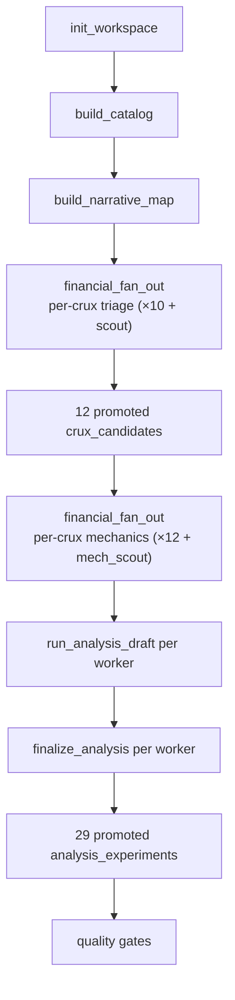

# Financial Fan-Out (Mechanics Layer) & Init Workspace QA — ORCL Run 25

## Scope

QA inspection of **init workspace substrate**, **narrative researcher output**, and the **`financial_fan_out` lane with per-crux mechanics fan-out** for one Oracle run. Compared against prior ORCL financial reports `06-13-012` (run 20), `06-13-013` (runs 20 vs 21), and `06-13-014` (run 24 — first triage fan-out, single mechanics pass).

| Run | SQLite path | Lane architecture | Financial explorer workers |
|-----|-------------|-------------------|----------------------------|
| **25** | `reports/stock-narrative-research/ORCL-2026-06-13-25/run.sqlite` | `financial_fan_out` (10 per-crux triage + scout + **12 per-crux mechanics + mech_scout**) | **24** |
| 24 | `reports/stock-narrative-research/ORCL-2026-06-13-24/run.sqlite` | `financial_fan_out` (9 per-crux + scout + **1 mechanics**) | 11 |
| 21 | `reports/stock-narrative-research/ORCL-2026-06-13-21/run.sqlite` | `identify_crux_candidates` + `financial_mechanics_experiments` | 2 |
| 20 | `reports/stock-narrative-research/ORCL-2026-06-13-20/run.sqlite` | Same as 21 | 2 |

Model for all workers: `deepseek/deepseek-v4-flash`.

Web validation: [Oracle Q4/FY2026 press release](https://investor.oracle.com/investor-news/news-details/2026/Oracle-Announces-Record-Q4-and-FY-2026-Results-Driven-by-Cloud-Infrastructure--Cloud-Applications/default.aspx), CNBC, 8-K summaries (June 2026).

Worker telemetry (run 25):

| Worker | Rounds | Tool calls | Cost | Latency |
|--------|--------|------------|------|---------|
| `narrative_researcher` | 14 | 27 | ~$0.047 | ~239s |
| `financial_model_explorer` (11× triage + scout) | 129 | 333 | ~$0.185 | ~1,672s |
| `financial_model_explorer` (12× mechanics + mech_scout) | 196 | 307 | ~$0.235 | ~2,245s |
| **Financial explorer total** | **325** | **640** | **~$0.421** | **~3,917s** |

For comparison: run 24 financial explorer total was 154 rounds / 358 tools / ~$0.215 / ~2,180s; run 21 was 43 / 79 / ~$0.078 / ~599s.

## Verdict

**Partial pass — the second fan-out layer (per-crux mechanics workers) resolves the triage-to-experiment gap that blocked run 24. All 12 promoted cruxes now have promoted experiments, including 8 forward projections and 6 sensitivities. Init workspace quality is unchanged (partial). Cost roughly doubled vs run 24 and ~5× vs run 21. Narrative arithmetic errors and SEC staleness in experiment baselines remain.**

Run 25 is the first ORCL run where `financial_fan_out` spawns **one mechanics worker per promoted crux** plus a `mech_scout` backfill worker (`src/lanes/financial_fan_out.rs` lines 193–231), instead of a single post-triage mechanics pass. The result is **29 promoted experiments** across **12/12 promoted cruxes** (vs 3 experiments on 3/11 cruxes in run 24), **32 supporting metrics**, **33 `data_quality_flags`**, **35 distinct `data_gaps`**, and **all 26 quality gates pass**.

Init substrate is identical to runs 20–24: **25,369 `sec_raw_facts`**, **513 concepts**, **807 observations**, SEC series through **Q3 FY2026** (`period_end` 2026-02-28). `run_metadata.financial_fetch_status` remains **partial** (price/market cap not in `fundamentals`, though claim #16 captures them).

Remaining weaknesses: **10 orphan `draft` `analysis_runs`** (6 failed, 4 successful-but-unfinalized), **duplicate staleness flags** from parallel workers, **narrative YoY growth misstatements** (~12% vs ~21% on Q4 revenue), and **forward experiments still anchor OCF ~$23B** instead of FY2026 actual **$32.0B**.

---

## Architecture Change: Second Fan-Out Layer

### What changed since run 24

Run 24 implemented **triage fan-out** (per-narrative-crux + scout) with a **single mechanics worker** afterward. `06-13-014` flagged this as the primary bottleneck: 11 promoted cruxes, only 3 with experiments.

Run 25 adds a **mechanics fan-out phase**:

1. **Triage phase** (unchanged): one `financial_model_explorer` per `narrative_map_items` crux row + scout.
2. **Mechanics phase** (new): one `financial_model_explorer` per promoted `crux_candidates` row + `mech_scout` for uncovered scout cruxes.

Each mechanics worker receives a `FOCUS:` prefix naming exactly one `crux_key`, instructing 1–2 experiments with `per_worker true` on `submit_mechanics_experiments`.

### Cross-run comparison

| Dimension | Run 20 | Run 21 | Run 24 | **Run 25** |
|-----------|--------|--------|--------|------------|
| Lane | identify_crux + mechanics | identify_crux + mechanics | financial_fan_out (triage only scaled) | **financial_fan_out (triage + mechanics)** |
| Narrative crux items | 7 | 8 | 9 | **10** |
| Promoted `crux_candidates` | 1 | 4 | 11 | **12** |
| Scout-discovered cruxes | 0 | 0 | 2 | **2** (`debt_stack_rollover`, `dilution_sbc_buyback_asymmetry`) |
| `supporting_metric_selections` | 0 | 6 | 30 | **32** |
| `data_quality_flags` | 0 | 0 | 27 | **33** |
| `data_gaps` (distinct keys) | 3 | 3 | 31 (with dupes) | **35** (no dupes) |
| Promoted experiments | 3 | 4 | 3 | **29** |
| `forward_projection` promoted | 0 | 1 | 0 | **8** |
| `sensitivity` promoted | 0 | 1 | 1 | **6** |
| `historical_investigation` promoted | 3 | 2 | 2 | **15** |
| Cruxes with ≥1 promoted experiment | 1/1 | 4/4 | 3/11 | **12/12** |
| Financial explorer cost | ~$0.040 | ~$0.078 | ~$0.215 | **~$0.421** |
| All gates pass | Yes (22) | Yes (26) | Yes (26) | **Yes (26)** |

The mechanics fan-out directly addresses recommendation #2 from `06-13-014` ("Scale mechanics to match triage"). Experiment coverage went from **27%** of promoted cruxes (run 24) to **100%** (run 25).

### Promoted crux → experiment coverage (run 25)

| Crux | Key | Promoted exps | Purposes |
|------|-----|---------------|----------|
| 1 | `capex_roic_stranding` | 2 | historical, forward |
| 2 | `rpo_inflation_risk` | 2 | historical, sensitivity |
| 3 | `self_fund_ai_buildout` | 4 | historical×2, forward×2 |
| 4 | `gross_margin_depreciation_compression` | 3 | historical×2, forward |
| 5 | `equity_risk_premium_reprice` | 3 | historical, sensitivity, forward |
| 6 | `multicloud_neutralization` | 2 | historical, sensitivity |
| 7 | `gpu_utilization_margin_pressure` | 2 | historical, forward |
| 8 | `ai_contract_persistence` | 2 | historical, sensitivity |
| 9 | `valuation_capital_intensity` | 2 | historical, sensitivity |
| 10 | `capital_allocation_tension` | 2 | historical, sensitivity |
| 11 | `debt_stack_rollover` (scout) | 2 | historical, forward |
| 12 | `dilution_sbc_buyback_asymmetry` (scout) | 3 | historical×2, forward |

Every promoted crux has at least one non-historical experiment when guidance or funding gaps are relevant — satisfying `experiment_purpose_diversity` with margin.

---

## What The Workspace Captures Well

### Init substrate (unchanged vs runs 20–24)

| Artifact | Run 25 | Status |
|----------|--------|--------|
| `sec_raw_facts` | 25,369 rows | Broad SEC universe |
| Distinct SEC concepts | 513 | Suitable for niche discovery |
| `concept_catalog_entries` | 516 | Tagged, searchable |
| `fundamental_observations` | 807 | Rich time series |
| `canonical_metric_mappings` | 9 | AV-backed core metrics |
| `av_raw_facts` | 5,643 | Alpha Vantage fundamentals |
| `revenue_ttm` (AV) | $67.358B (2026-05-31) | Matches FY2026 release |
| `shares_outstanding` | 2.876B | Consistent with SEC instant facts |
| `total_debt` (AV) | $156.2B | Aligns with narrative leverage theme |
| Latest SEC `period_end` (RPO, OCF, capex) | 2026-02-28 (Q3 FY2026) | Expected filing lag |

### Mechanics fan-out strengths

- **Full crux coverage:** ROIC stranding, RPO reliability, self-funding, margin compression, post-earnings reprice, multicloud, GPU utilization, AI contract persistence, valuation, capital allocation, debt rollover, and dilution/SBC all have quantitative hooks.
- **Forward projection restored:** 8 promoted forward experiments vs 0 in run 24 and 1 in run 21. Includes `fy2027_funding_gap_projection`, `capex_roic_forward_sensitivity`, `debt_refi_burden_projection`, `dilution_eps_forward_projection`, and others.
- **Scout mechanics land:** Scout triage cruxes `debt_stack_rollover` and `dilution_sbc_buyback_asymmetry` each received 2–3 experiments — the gap run 24 left open.
- **Staleness persistence:** 33 `data_quality_flags` document SEC-vs-claim boundaries (`sec_rpo_stale`, `sec_facts_stale_q4_fy2026`, `sec_facts_stale_fy2027_capex`, etc.).
- **Gap deduplication improved:** 35 gaps with 35 distinct `gap_key` values (run 24 had duplicate keys from parallel triage workers).
- **Assumptions document SEC/claim boundaries:** Forward experiments explicitly note SEC lag vs management guidance in `assumptions_json`.

### Representative experiments

| Key | Purpose | Crux | Assessment |
|-----|---------|------|------------|
| `fy2027_funding_gap_projection` | forward | self_fund | Projects FY27 ~$70B net capex vs OCF scenarios; documents SEC staleness. OCF baseline ~$23.1B annualized from Q3 YTD — understates FY2026 actual $32.0B. |
| `self_fund_fy27_funding_gap_sensitivity` | forward | self_fund | Brackets 10–25% OCF CAGR from FY2025 $20.8B base. Honest about guidance dependency. |
| `rpo_conversion_to_fund_capex_sensitivity` | sensitivity | rpo_inflation | Uses $92.5B capex midpoint; cites SEC staleness. |
| `debt_refi_burden_projection` | forward | debt_stack (scout) | Addresses maturity wall — thread run 24 scout triage missed in experiments. |
| `dilution_eps_forward_projection` | forward | dilution (scout) | Models SBC/buyback asymmetry — uses shares from AV, not live price from fundamentals. |
| `capex_ocf_funding_gap` | historical | self_fund | Sound SEC arithmetic through filed periods; stops before FY2026 Q4 intensity. |

---

## Data Quality Findings

| Severity | Finding | Where | Suggested fix |
|----------|---------|-------|---------------|
| **High** | Q4 revenue growth misstated as ~12% YoY | `claims` #1 | Official Q4 FY2026 revenue growth is **21% YoY** ($19.2B vs ~$15.9B). Same class of error as run 24 (11%). Narrative arithmetic gate still needed. |
| **High** | Forward OCF baseline ~$23B, not FY2026 actual $32.0B | `fy2027_funding_gap_projection` assumptions | Persists from runs 21–24. When claims or press release cite FY2026 OCF, gate should require dual-scenario baselines (SEC conservative vs claim actual). |
| **High** | 10 orphan `draft` `analysis_runs` | `analysis_runs` (6 `execution_status=error`, 4 `success` unfinalized) | Per-worker mechanics may draft without finalizing. Add post-fan-out cleanup or gate on zero orphan drafts. |
| **Medium** | Financial explorer cost ~2× run 24, ~5× run 21 | `worker_runs` | 325 rounds / ~$0.42 / ~65 min financial lane. Acceptable if coverage holds; consider caching Phase 0 orient SQL across workers. |
| **Medium** | Duplicate staleness flags | `data_quality_flags` (`sec_facts_stale_q4_fy2026` ×2; 33 rows vs 32 distinct keys) | Normalize `flag_key` on insert from parallel triage workers. |
| **Medium** | Claim #3 GAAP net income $4.304B | `claims` #3 | Press release: **$4.22B** GAAP. Immaterial for modelling but affects claim trust. |
| **Medium** | Price/mcap in claims but not `fundamentals` | `run_metadata` partial; claim #16 has $184.13 / $529.57B | Init workspace gap blocks deterministic valuation experiments; claims are workaround only. |
| **Medium** | Sensitivity/historical still use Q3 SEC RPO ($552.6B) | Multiple experiments | Flags document staleness; arithmetic at $638B claim base would differ (~7.4% vs ~8.5% implied conversion). |
| **Low** | `stock_info.exchange` blank | `stock_info` | NYSE listing not persisted. |
| **Low** | `generated/` directory empty | Run folder | Expected pre-report stage. |
| **Low** | Some experiments overlap thematically | crux 3 has 4 promoted exps | Acceptable for coverage; downstream dedupe may be needed before report drafting. |

### Narrative claim hygiene (selected)

| Claim | Issue | External |
|-------|-------|----------|
| #1 Q4 revenue ~12% YoY | **Wrong** | ~21% YoY per press release / CNBC |
| #3 Q4 GAAP net income $4.304B | Approximate | $4.22B GAAP per release |
| #5 RPO $638B | **Match** | $638B in release |
| #6 FY2027 revenue ~$100B | **Match** | Guided in release |
| #11 Total debt ~$156B | **Approximate** | AV $156.2B; SEC carrying concepts lag |
| #15 FY2026 revenue $67.4B | **Match** | $67.4B in release |
| #16 Price $184.13, mcap $529.57B | Plausible | Not in `fundamentals`; secondary validation only |

---

## Product Readiness

| Capability | Run 21 | Run 24 | Run 25 | Notes |
|------------|--------|--------|--------|-------|
| Deterministic SEC/AV fundamentals | Yes | Yes | Yes | Same ingestion |
| Canonical concept linking | Yes | Yes | Yes | 9 AV mappings |
| Interesting concept discovery | Good | Better | **Better** | Scout + 35 gaps |
| Provenance / staleness visibility | Weak | Strong | **Strong** | 33 quality flags |
| Narrative → crux mapping | Partial (4/8) | Full (9/9 + 2 scout) | **Full (10/10 + 2 scout)** | Fan-out triage |
| Crux → experiment mapping | Partial (4/4) | **Weak (3/11)** | **Full (12/12)** | Mechanics fan-out win |
| Forward/sensitivity for guidance | Yes | Partial | **Yes** | 8 forward + 6 sensitivity |
| Scenario-ready without re-fetch | Closer | Mixed | **Much closer** | Broad experiment hooks; SEC staleness still limits precision |

A downstream scenario agent can now query **experiments on every promoted crux** — ROIC, OCI/multicloud, dilution, debt rollover, GPU margins, and valuation — not just RPO/funding/interest coverage. The main residual risk is **stale SEC baselines in forward math**, not missing experiment rows.

---

## Web Validation

| Field | DB / run value | External value | Status |
|-------|----------------|----------------|--------|
| FY2026 revenue (AV TTM) | $67.358B (`fundamentals`, 2026-05-31) | $67.4B FY2026 total | **Match** |
| Q4 FY2026 revenue | $19.184B in claim #1 metric hook | $19.2B | **Match** (value); growth rate wrong |
| Q4 YoY revenue growth | Claim #1: "~12%" | **21%** | **Mismatch — narrative error** |
| RPO (latest SEC) | $552.6B (`period_end` 2026-02-28) | $638B Q4 FY2026 | **Stale in SEC** — flagged |
| RPO (claims) | $638B (claim #5) | $638B | **Match** |
| FY2026 OCF | Experiments use ~$23B; SEC annual through FY2025 | **$32.0B** FY2026 per release | **Stale in experiments** |
| FY2026 FCF | Not in starter fundamentals | **-$23.7B** per release | Directionally in claims |
| FY2027 guided capex | $90–95B (claims #7) | ~$90–95B gross; ~$70B net cited in experiments | **Match** (range) |
| Total debt (AV) | $156.2B | Narrative ~$156B | **Approximate** |
| Shares outstanding | 2.876B (AV) | ~2.88B post-raise context | **Approximate** |
| GAAP FY2026 EPS | `eps_ttm` 5.84 | $5.83 GAAP / $7.63 non-GAAP | **Approximate** |
| Q4 GAAP net income | Claim #3: $4.304B | $4.22B | **Approximate** |

---

## Recommendations

1. **Keep mechanics fan-out.** Run 25 validates the architecture change recommended in `06-13-014`. Per-crux mechanics workers are the right fix for triage-to-experiment gap; do not roll back to single mechanics pass.

2. **Add orphan-draft cleanup gate.** After mechanics fan-out, require zero `analysis_runs` with `status='draft'` or auto-finalize successful drafts. Run 25 has 10 orphans (6 errors).

3. **Dual OCF baseline gate.** When FY2026 OCF is available in claims/press ($32.0B), forward experiments should record both SEC-trailing and claim-actual scenarios — same recommendation from runs 21–24, still open.

4. **Narrative arithmetic gate.** Flag claims where YoY growth contradicts headline values (would catch claim #1 at ~12% vs 21%).

5. **Cache shared orient context.** 24 financial workers each re-run Phase 0 catalog discovery. Shared `load_explorer_context` in the parent would cut cost toward run-24 triage-only levels.

6. **Dedupe quality flags on persist.** Gap deduplication improved (35/35 distinct); flags still have 1 duplicate key. Apply same normalization as gaps.

7. **Init workspace unchanged.** Price/market cap ingestion and Q4 SEC fact refresh remain upstream limits. Persisting claim #16 price/mcap into `fundamentals` would unlock valuation experiments without re-fetch.

8. **Cost ceiling documentation.** Run 25 total worker cost ~$0.47 (~$0.42 financial) / ~65 min financial lane. Define acceptable band for routine runs now that coverage is complete.

---

## Bottom Line

Run 25 confirms the **second fan-out layer** fixes the primary failure mode of run 24. Where run 24 delivered excellent triage (11 cruxes, 30 supporting metrics, 27 flags) but only **3 experiments on 3 cruxes**, run 25 delivers **29 promoted experiments on 12/12 cruxes** with **8 forward projections** and restored purpose diversity.

Compared to the arc documented in `06-13-012` → `06-13-013` → `06-13-014`:

- Runs 20–21: gates improved triage breadth but mechanics stayed narrow.
- Run 24: triage fan-out solved crux coverage; single mechanics pass did not scale.
- **Run 25: mechanics fan-out closes the loop** at ~2× run-24 cost.

Init workspace remains **partial** (same SEC universe, same missing price/mcap). Narrative arithmetic and SEC-stale experiment baselines are the main data-quality risks — not missing experiment coverage.

Next iteration: **orphan draft hygiene**, **dual OCF baselines**, **narrative arithmetic QA**, and **init price ingestion** — not rolling back fan-out architecture.

---

## Appendix: Gate Results (all pass)

`init_workspace` (4) · `build_catalog` (3) · `build_narrative_map` (5) · `financial_fan_out` (14):

`crux_candidates_present`, `crux_candidates_falsifiable`, `crux_coverage_vs_narrative`, `supporting_metrics_present`, `promoted_metrics_have_rationale`, `narrative_context_present`, `experiments_have_questions`, `min_promoted_experiments`, `experiment_purpose_diversity`, `arithmetic_vs_interpretation_split`, `inputs_and_units_recorded`, `period_shape_labeled`, `promoted_linked_to_sources`, `rejected_experiments_explained`.

---

## Appendix: Lifecycle — Mechanics Fan-Out (crux 3 example)

Narrative crux #3 ("Can Oracle self-fund its AI buildout…") maps to promoted `self_fund_ai_buildout` with **4 promoted experiments**: `capex_ocf_funding_gap` (historical), `self_fund_ocf_capex_ratio_trend` (historical), `self_fund_fy27_funding_gap_sensitivity` (forward), `fy2027_funding_gap_projection` (forward). In run 24, this crux had supporting metrics from triage but **zero experiments**.
