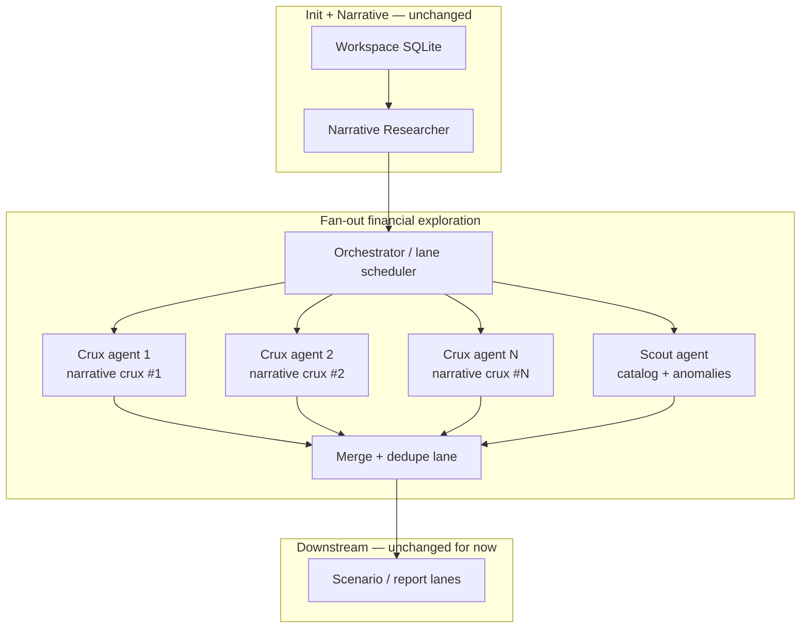

# POV: Fan-Out Financial Exploration

## Problem

Run 20 (`ORCL-2026-06-13-20`) showed that a **single** Financial Model Explorer agent, even with a good golden path, tends to:

- Collapse many narrative cruxes into one promoted `crux_candidate`
- Run experiments only on the dominant thread (RPO → funding)
- Exit as soon as gates pass (historical SQL only, SEC-stale tails)
- Batch-finalize under step-budget pressure

Tightening prompts and validation (June 2026 changes) raises the floor, but a monolithic agent still competes with itself for step budget and attention.

This document sketches a **fan-out pattern**: parallel specialized workers plus one **scout** agent for non-obvious mechanics.

---

## Proposed shape



### Worker types

| Worker | Scope | Input focus | Output |
|--------|--------|-------------|--------|
| **Per-crux agent** | One `narrative_map_items` crux (or small cluster) | Crux body, linked claims, 2–3 catalog concepts, SEC freshness for those concepts | 0–1 promoted `crux_candidate`, 1–2 `supporting_metrics`, 1–2 `analysis_experiments` |
| **Scout agent** | Whole workspace, no narrative anchor | `concept_catalog_entries` sorted by `fact_count`, `narrative_tags`, recent `period_end`; compare to what narrative *didn't* mention | 0–2 `crux_candidates` (`disposition: background` OK), 1–3 experiments on “un discussed” mechanics (working capital, dilution, segment mix, etc.) |
| **Merge lane** | Deterministic | All worker rows | Dedupe keys, resolve conflicts, run gates, write `quality_gate_results` |

---

## Per-crux agent design

**Prompt delta from today:** Strip global “analyze Oracle” framing. Open with:

```
You own narrative crux #3 only: "Can Oracle achieve positive FCF while maintaining this capex pace?"
Linked claims: [ids + one-line summaries]
Your job: find falsifiable mechanics and 1–2 SQLite experiments for THIS crux only.
Do not re-triage other cruxes.
```

**Tools:** `workspace_sql`, `run_analysis_draft`, `finalize_analysis`, `submit_crux_slice` (new — partial submit, not full lane complete).

**Budget:** ~8–12 agent rounds per crux (vs 24+36 monolithic today). Seven cruxes × 10 rounds ≈ 70 rounds total but **parallel**, wall-clock ~1× single crux depth.

**Persistence convention:**

- `crux_key`: `narrative_crux_{item_order}` or semantic slug from narrative
- `analysis_experiments.crux_id`: tied to that candidate only
- `worker_runs.metadata_json`: `{"fanout":"per_crux","narrative_item_order":3}`

**Partial submit payload (`submit_crux_slice`):**

```json
{
  "narrative_item_order": 3,
  "crux": { "...": "one CruxCandidateInput" },
  "supporting_metrics": ["..."],
  "experiments": ["... finalized experiment keys or inline finalize calls"]
}
```

Merge lane upserts by `crux_key` / `experiment_key`.

---

## Scout agent design

**Mission:** Surface mechanics that **should** matter for scenario work but are absent from the narrative board — not to duplicate bull/bear debate.

**Golden path (scout-specific):**

1. List top 30 catalog concepts by `latest_period_end` × `fact_count`, excluding concepts already in `supporting_metric_selections` or promoted experiment `inputs_json`.
2. Flag series with sharp YoY or QoQ moves not referenced in any `claims.metric` or `narrative_tags`.
3. Cross-check: debt/cash flow/margin concepts for filers with heavy capex narratives but no leverage experiment.
4. Propose **background** cruxes or **candidate** experiments with explicit `rationale`: “Narrative silent on X; SEC shows Y.”

**Examples for ORCL-style names:**

- `StockholdersEquity` / ATM dilution vs `$20B` equity program (narrative mentions raise, may not model shares)
- Segment revenue mix (cloud vs legacy) — narrative mentions SaaS slowdown bear thread but may not SQL it
- `RevenueRemainingPerformanceObligationPercentage` (conversion disclosure) — stale in SEC but scout flags “concept exists, series dead”
- Working capital / deferred revenue bridges adjacent to RPO

**Guardrails:**

- Scout cannot **promote** more than 2 cruxes without linked SEC or claim evidence
- Scout experiments default to `disposition: candidate` until merge review
- No web search unless `data_gaps` block SEC-only path

---

## Merge lane

Deterministic Rust (no LLM) or lightweight judge model:

| Step | Action |
|------|--------|
| 1 | Upsert all `crux_candidates` by `crux_key` |
| 2 | Upsert `supporting_metric_selections` (dedupe taxonomy+concept+unit) |
| 3 | Upsert `analysis_experiments` / `analysis_runs` |
| 4 | **Conflict rules:** same `experiment_key` → keep higher `row_count` success + newer `updated_at`; contradictory ratio labels → flag `data_quality_flags` |
| 5 | Run existing gates + new **coverage gate:** every narrative crux has promoted OR background candidate with `rationale` |
| 6 | Scout-only cruxes capped at 2 promoted |

---

## Orchestration options

### A. Lane-level parallel (preferred)

Extend `research_pipeline` with a `FanOutFinancialExplorationLane`:

```rust
// Pseudocode
for item in narrative_cruxes {
    tasks.push(run_per_crux_agent(item));
}
tasks.push(run_scout_agent());
join_all(tasks).await?;
run_merge_lane().await?;
```

Uses existing `ToolLoopAgent` + per-task SQLite **read-mostly** (writes via namespaced keys or merge-only writes to avoid lock contention).

**SQLite note:** Concurrent writes to one DB are risky. Options:

- Workers write to `worker_artifacts` JSON blobs keyed by `worker_id`; merge lane persists to canonical tables (simplest)
- Or WAL mode + short transactions per `finalize_analysis`

### B. Cursor SDK / external orchestrator

Fan-out as separate `initWorkspace` subcommands or SDK jobs per crux — better for cloud scale, heavier ops.

---

## Comparison to monolithic path

| Dimension | Monolithic (today, tightened) | Fan-out |
|-----------|------------------------------|---------|
| Crux coverage | Agent may still cluster | **Forced** per narrative item |
| Step budget | Shared; penultimate submit rush | Isolated per worker |
| Scout / blind spots | Unlikely | **Dedicated** scout pass |
| Cost | ~$0.04 financial (run 20) | ~$0.08–0.15 (7+1 workers) but parallel latency |
| Complexity | Low | Merge + orchestration |
| Debuggability | One `worker_runs` row | Per-crux telemetry; easier to see which crux failed |

---

## Phased rollout

**Phase 1 — Prompt-only fan-out (no new infra)**  
Run per-crux agents manually or via script calling the same explorer with `crux_item_order` injected in prompt; merge with a task. Validates value before schema changes.

**Phase 2 — `submit_crux_slice` + merge lane**  
Partial submits, artifact staging table, deterministic merge.

**Phase 3 — Scout lane + coverage gates**  
Background crux budget, narrative-silent concept mining.

**Phase 4 — Scenario integration**  
Each scenario assumption links to `crux_key` + `experiment_key` from fan-out, not free-text.

---

## Open questions

1. **Clustering:** Should related narrative cruxes (FCF + capex + dilution) merge into one worker automatically?
2. **Model mix:** Per-crux flash + scout pro, or uniform?
3. **Human review:** Merge lane auto-promote vs `candidate` queue for scout outputs?
4. **Earnings week:** Trigger scout only when `data_gaps` contains SEC lag?

---

## Recommendation

Adopt fan-out if the next ORCL re-run still collapses cruxes **after** the June 2026 prompt/gate tightening. Start with **Phase 1** (scripted per-crux runs + manual merge) to measure coverage and cost; if ≥5 distinct experiment bridges appear with acceptable spend, invest in Phase 2 merge automation.

The monolithic path remains the **default for thin narratives** (<3 cruxes) and CI fixtures; fan-out is for catalyst-heavy names where narrative breadth exceeds what one agent can model in ~15 steps.
